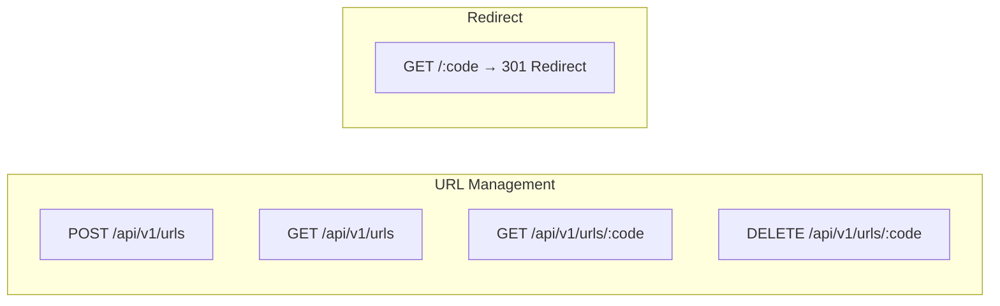
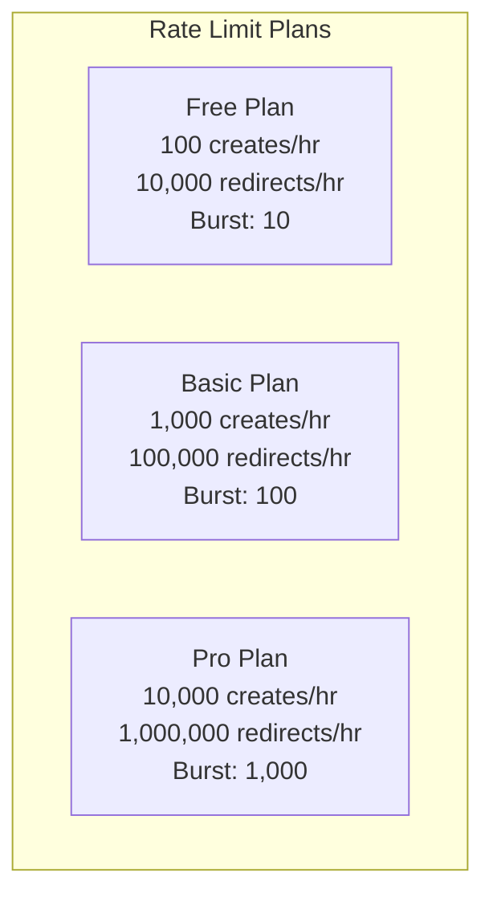
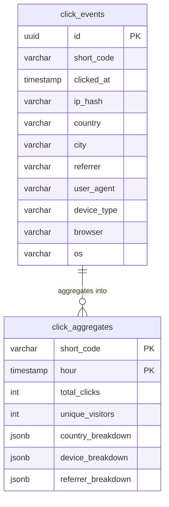
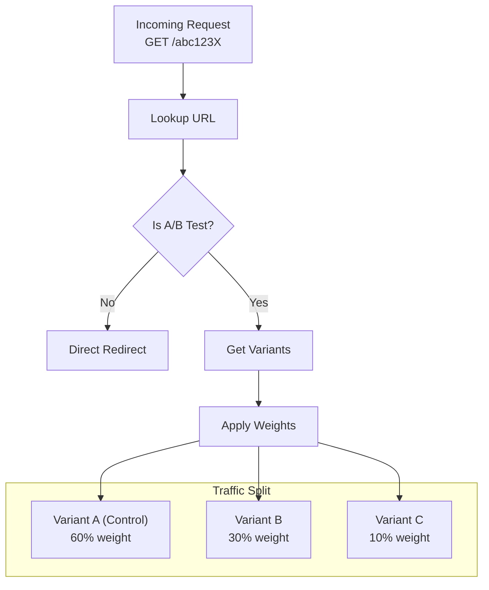
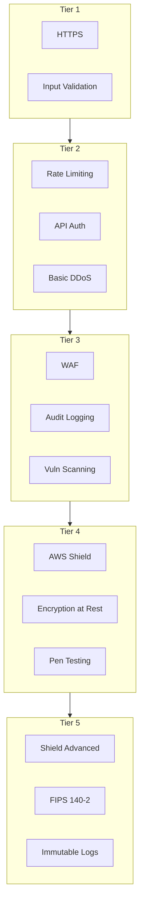
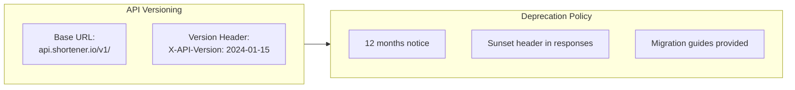

# Functional and Non-Functional Requirements

This document details the requirements for each scaling tier of the URL shortener system.

---

## Requirements Evolution by Tier

```mermaid
flowchart LR
    subgraph Tier1["Tier 1"]
        F1["Basic CRUD"]
        F2["Custom Alias"]
        F3["Click Counting"]
    end

    subgraph Tier2["Tier 2"]
        F4["API Key Auth"]
        F5["Rate Limiting"]
        F6["Basic Analytics"]
    end

    subgraph Tier3["Tier 3"]
        F7["Real-time Analytics"]
        F8["Custom Domains"]
        F9["Webhooks"]
    end

    subgraph Tier4["Tier 4"]
        F10["A/B Testing"]
        F11["Multi-tenant"]
        F12["SSO/SAML"]
    end

    subgraph Tier5["Tier 5"]
        F13["Edge Redirects"]
        F14["Fraud Detection"]
        F15["ML Abuse Prevention"]
    end

    Tier1 --> Tier2 --> Tier3 --> Tier4 --> Tier5
```



---

## Tier 1: Local Development (1K URLs/month)

### Functional Requirements

| ID | Requirement | Priority | Description |
|----|-------------|----------|-------------|
| F1.1 | Create Short URL | Must Have | Generate a unique short code for any valid URL |
| F1.2 | Custom Alias | Should Have | Allow users to specify custom short codes |
| F1.3 | URL Redirect | Must Have | Redirect short URL to original destination |
| F1.4 | Click Counting | Should Have | Track total clicks per URL |
| F1.5 | URL Expiration | Should Have | Support configurable TTL for URLs |
| F1.6 | URL Listing | Could Have | List all created URLs |
| F1.7 | URL Deletion | Should Have | Delete a short URL |

### Non-Functional Requirements

| ID | Requirement | Target | Rationale |
|----|-------------|--------|-----------|
| NF1.1 | Latency | < 50ms p99 | Local network, minimal overhead |
| NF1.2 | Throughput | 10 RPS | Single user development |
| NF1.3 | Storage | SQLite file | Zero configuration |
| NF1.4 | Availability | Best effort | Development environment |
| NF1.5 | Durability | File backup | SQLite WAL mode |
| NF1.6 | Memory | < 50 MB | Lightweight footprint |
| NF1.7 | Startup Time | < 1 second | Fast iteration |

### API Endpoints (Tier 1)



---

## Tier 2: Startup (100K URLs/month)

### Functional Requirements

| ID | Requirement | Priority | Description |
|----|-------------|----------|-------------|
| F2.1 | All Tier 1 | Must Have | All previous functionality |
| F2.2 | API Key Auth | Must Have | Authenticate requests with API keys |
| F2.3 | Rate Limiting | Must Have | Limit requests per API key |
| F2.4 | Basic Analytics | Should Have | Click counts, creation date, last accessed |
| F2.5 | URL Validation | Must Have | Validate destination URLs (reachability check optional) |
| F2.6 | Error Responses | Must Have | Structured error responses with codes |
| F2.7 | URL Metadata | Should Have | Title, description extraction |
| F2.8 | Bulk Creation | Could Have | Create multiple URLs in one request |

### Non-Functional Requirements

| ID | Requirement | Target | Rationale |
|----|-------------|--------|-----------|
| NF2.1 | Latency | < 100ms p99 | Single server with caching |
| NF2.2 | Throughput | 100 RPS | Small team usage |
| NF2.3 | Availability | 99% | ~7.3 hours downtime/month acceptable |
| NF2.4 | Durability | 99.9% | Daily backups |
| NF2.5 | Cache Hit Rate | > 80% | Redis caching |
| NF2.6 | Backup Frequency | Daily | Automated PostgreSQL backups |
| NF2.7 | Recovery Time | < 1 hour | From latest backup |
| NF2.8 | Security | TLS 1.2+ | All traffic encrypted |

### Rate Limits (Tier 2)



---

## Tier 3: Growth (10M URLs/month)

### Functional Requirements

| ID | Requirement | Priority | Description |
|----|-------------|----------|-------------|
| F3.1 | All Tier 2 | Must Have | All previous functionality |
| F3.2 | Real-time Analytics | Must Have | Live click counts, referrers, locations |
| F3.3 | Geographic Tracking | Must Have | Country, city, region from IP |
| F3.4 | Device Detection | Should Have | Browser, OS, device type |
| F3.5 | Custom Domains | Should Have | Use customer's own domain |
| F3.6 | Bulk Operations | Must Have | Import/export CSV, bulk delete |
| F3.7 | Webhooks | Should Have | Notify on click events |
| F3.8 | Link Previews | Could Have | Social media preview cards |
| F3.9 | QR Codes | Should Have | Generate QR codes for URLs |
| F3.10 | Tags/Labels | Should Have | Organize URLs with tags |

### Non-Functional Requirements

| ID | Requirement | Target | Rationale |
|----|-------------|--------|-----------|
| NF3.1 | Latency | < 50ms p99 | With caching and optimization |
| NF3.2 | Throughput | 1,000 RPS | Growing user base |
| NF3.3 | Availability | 99.9% | ~43 minutes downtime/month |
| NF3.4 | Durability | 99.99% | PostgreSQL with replicas |
| NF3.5 | Cache Hit Rate | > 90% | Redis cluster |
| NF3.6 | Auto-scaling | 2-10 instances | Based on CPU/RPS |
| NF3.7 | Backup RPO | 1 hour | Point-in-time recovery |
| NF3.8 | Backup RTO | < 30 min | Automated failover |
| NF3.9 | Horizontal Scale | Linear | Add nodes = add capacity |
| NF3.10 | Geographic Coverage | Single region | Primary + DR region |

### Analytics Schema (Tier 3)



---

## Tier 4: Scale (100M URLs/month)

### Functional Requirements

| ID | Requirement | Priority | Description |
|----|-------------|----------|-------------|
| F4.1 | All Tier 3 | Must Have | All previous functionality |
| F4.2 | A/B Testing | Must Have | Split traffic between destinations |
| F4.3 | Advanced Analytics | Must Have | Funnels, cohorts, retention |
| F4.4 | Multi-tenant | Must Have | Enterprise workspace isolation |
| F4.5 | SSO/SAML | Should Have | Enterprise identity providers |
| F4.6 | Audit Logs | Must Have | Complete action audit trail |
| F4.7 | Team Management | Must Have | Roles, permissions, teams |
| F4.8 | SLA Monitoring | Should Have | Per-customer SLA tracking |
| F4.9 | Link Rotation | Could Have | Rotate destinations on schedule |
| F4.10 | Deep Linking | Should Have | Mobile app deep links |
| F4.11 | UTM Builder | Should Have | Automatic UTM parameter management |
| F4.12 | Compliance Export | Must Have | Data export for GDPR/CCPA |

### Non-Functional Requirements

| ID | Requirement | Target | Rationale |
|----|-------------|--------|-----------|
| NF4.1 | Latency | < 30ms p99 globally | Multi-region deployment |
| NF4.2 | Throughput | 10,000 RPS | Enterprise scale |
| NF4.3 | Availability | 99.95% | ~22 minutes downtime/month |
| NF4.4 | Durability | 99.999% | DynamoDB Global Tables |
| NF4.5 | Cache Hit Rate | > 95% | Edge + regional cache |
| NF4.6 | Multi-region | 3 regions | Active-active |
| NF4.7 | Failover Time | < 30 seconds | Automatic DNS failover |
| NF4.8 | Compliance | GDPR, CCPA | Built-in compliance |
| NF4.9 | Encryption | At rest + transit | AES-256, TLS 1.3 |
| NF4.10 | Audit Retention | 2 years | Compliance requirement |

### A/B Testing Flow



---

## Tier 5: Global (500M URLs/month)

### Functional Requirements

| ID | Requirement | Priority | Description |
|----|-------------|----------|-------------|
| F5.1 | All Tier 4 | Must Have | All previous functionality |
| F5.2 | Edge Redirects | Must Have | Lambda@Edge for ultra-low latency |
| F5.3 | Fraud Detection | Must Have | Real-time bot/abuse detection |
| F5.4 | ML Abuse Prevention | Should Have | ML-based spam detection |
| F5.5 | Real-time Dashboard | Must Have | Live global traffic visualization |
| F5.6 | Predictive Analytics | Should Have | Traffic forecasting |
| F5.7 | Custom Reporting | Must Have | Scheduled/ad-hoc reports |
| F5.8 | API Gateway | Must Have | Partner API with OAuth 2.0 |
| F5.9 | White-label | Should Have | Fully brandable solution |
| F5.10 | Geographic Routing | Should Have | Route by user location |
| F5.11 | Compliance Audit | Must Have | SOC2, HIPAA certification support |
| F5.12 | Data Residency | Must Have | Regional data storage compliance |

### Non-Functional Requirements

| ID | Requirement | Target | Rationale |
|----|-------------|--------|-----------|
| NF5.1 | Latency | < 20ms p99 globally | Edge computing |
| NF5.2 | Throughput | 50,000+ RPS | Internet-scale traffic |
| NF5.3 | Availability | 99.99% | ~4 minutes downtime/month |
| NF5.4 | Durability | 99.9999999% | 11 9s with cross-region replication |
| NF5.5 | Cache Hit Rate | > 98% | Edge + regional + local cache |
| NF5.6 | Global Presence | 50+ locations | CloudFront PoPs |
| NF5.7 | Auto-healing | < 10 seconds | Automatic instance replacement |
| NF5.8 | Compliance | GDPR, CCPA, SOC2, HIPAA | Full compliance suite |
| NF5.9 | Disaster Recovery | Multi-region active-active | Zero RPO |
| NF5.10 | Threat Protection | DDoS mitigation | AWS Shield Advanced |
| NF5.11 | Audit Retention | 7 years | SOC2/HIPAA requirement |
| NF5.12 | Encryption | FIPS 140-2 | Government/enterprise compliance |

### Edge Architecture (Tier 5)

```mermaid
sequenceDiagram
    participant User
    participant CloudFront
    participant Lambda@Edge
    participant Redis as Redis Global
    participant Origin as Origin (EKS)

    User->>CloudFront: GET /abc123X
    CloudFront->>Lambda@Edge: Viewer Request
    Lambda@Edge->>Redis: Check Cache

    alt Cache Hit
        Redis-->>Lambda@Edge: URL Found
        Lambda@Edge-->>CloudFront: 301 Redirect
        CloudFront-->>User: 301 → destination.com
        Note over Lambda@Edge: ~5-15ms response
    else Cache Miss
        Lambda@Edge->>CloudFront: Forward to Origin
        CloudFront->>Origin: Fetch URL
        Origin-->>CloudFront: URL + Cache Headers
        CloudFront-->>User: 301 Redirect
        Note over Lambda@Edge: Cache for future
    end
```

---

## Cross-Cutting Requirements

### Security Requirements (All Tiers)



### Operational Requirements (All Tiers)

| Requirement | Tier 1 | Tier 2 | Tier 3 | Tier 4 | Tier 5 |
|-------------|--------|--------|--------|--------|--------|
| Monitoring | Logs | Basic | Full | Full | Real-time |
| Alerting | - | Email | PagerDuty | PagerDuty | Multi-channel |
| On-call | - | Best effort | Business hours | 24/7 | 24/7 + escalation |
| Runbooks | - | Basic | Comprehensive | Comprehensive | Automated |
| Disaster Recovery | - | Manual | Automated | Multi-region | Active-active |
| Change Management | - | Manual | CI/CD | GitOps | GitOps + approval |

---

## API Versioning Strategy



## Error Response Format

```json
{
  "error": {
    "code": "URL_NOT_FOUND",
    "message": "The requested short URL does not exist",
    "details": {
      "short_code": "abc123X",
      "suggestion": "Check the URL for typos"
    },
    "request_id": "req_abc123xyz",
    "documentation_url": "https://docs.shortener.io/errors/URL_NOT_FOUND"
  }
}
```

## Common Error Codes

| Code | HTTP Status | Description |
|------|-------------|-------------|
| `URL_NOT_FOUND` | 404 | Short code doesn't exist |
| `URL_EXPIRED` | 410 | URL has expired |
| `URL_DISABLED` | 403 | URL has been disabled |
| `INVALID_URL` | 400 | Destination URL is invalid |
| `ALIAS_TAKEN` | 409 | Custom alias already in use |
| `RATE_LIMITED` | 429 | Too many requests |
| `UNAUTHORIZED` | 401 | Invalid or missing API key |
| `FORBIDDEN` | 403 | Insufficient permissions |
| `INTERNAL_ERROR` | 500 | Unexpected server error |
