# System Architecture

This document describes the detailed architecture of the URL shortener system, including component design, data flows, and key architectural decisions.

---

## High-Level Architecture

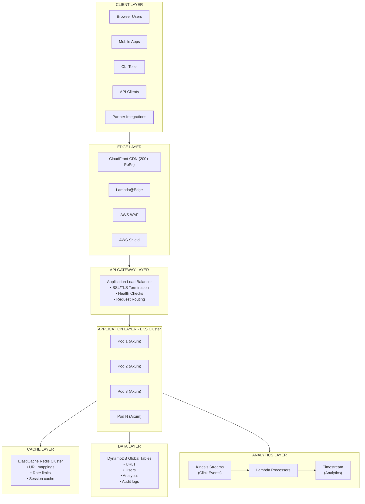

---

## Component Architecture

### 1. Edge Layer (CloudFront + Lambda@Edge)

The edge layer handles the majority of redirect traffic with ultra-low latency.

```mermaid
sequenceDiagram
    participant User
    participant CloudFront
    participant Lambda@Edge
    participant EdgeCache
    participant Origin
    
    User->>CloudFront: GET /abc123X
    CloudFront->>Lambda@Edge: Viewer Request
    Lambda@Edge->>EdgeCache: Check Edge Cache
    
    alt Cache Hit
        EdgeCache-->>Lambda@Edge: URL Found
        Lambda@Edge-->>CloudFront: Return Redirect
        CloudFront-->>User: 301 Redirect
    else Cache Miss
        Lambda@Edge->>CloudFront: Forward to Origin
        CloudFront->>Origin: Request
        Origin-->>CloudFront: Response
        CloudFront-->>User: 301 Redirect
    end
```

**Lambda@Edge Functions:**

| Function | Trigger | Purpose |
|----------|---------|---------|
| `viewer-request` | Before cache check | Authentication, rate limiting |
| `origin-request` | On cache miss | Modify request to origin |
| `origin-response` | After origin response | Cache headers, error handling |
| `viewer-response` | Before response to user | Analytics headers |

### 2. API Layer (Axum Application)

The core application is built with Rust and the Axum framework.

```mermaid
flowchart TB
    subgraph AxumApp["AXUM APPLICATION"]
        subgraph Router["ROUTER"]
            API["/api/v1/*<br/>(API)"]
            Redirect["/:code<br/>(Redirect)"]
            Health["/health<br/>(Health)"]
        end
        
        subgraph Middleware["MIDDLEWARE STACK"]
            Tracing["Tracing"]
            RateLimit["Rate Limit"]
            Auth["Auth"]
            Metrics["Metrics"]
        end
        
        subgraph Handlers["HANDLERS"]
            URLHandlers["URL Handlers"]
            AnalyticsHandlers["Analytics Handlers"]
            AdminHandlers["Admin Handlers"]
        end
        
        subgraph Domain["DOMAIN LAYER"]
            URLService["URL Service"]
            AnalyticsService["Analytics Service"]
            ComplianceService["Compliance Service"]
        end
        
        subgraph Infra["INFRASTRUCTURE LAYER"]
            DDBClient["DynamoDB Client"]
            RedisClient["Redis Client"]
            S3Client["S3 Client"]
            KinesisClient["Kinesis Client"]
            SESClient["SES Client"]
        end
        
        Router --> Middleware --> Handlers --> Domain --> Infra
    end
```

### 3. Data Layer

#### DynamoDB Table Design

**URLs Table (Main)**

| Attribute | Type | Key | Description |
|-----------|------|-----|-------------|
| `pk` | String | PK | `URL#<short_code>` |
| `sk` | String | SK | `v0` (version) |
| `original_url` | String | - | Destination URL |
| `created_at` | Number | - | Unix timestamp |
| `expires_at` | Number | GSI1-PK | TTL for expiration |
| `user_id` | String | GSI2-PK | Owner's user ID |
| `tier` | String | - | free/premium/enterprise |
| `click_count` | Number | - | Atomic counter |
| `is_active` | Boolean | - | Soft delete flag |
| `custom_alias` | Boolean | - | Was this a custom code |
| `metadata` | Map | - | Tags, notes, etc. |

**Access Patterns:**

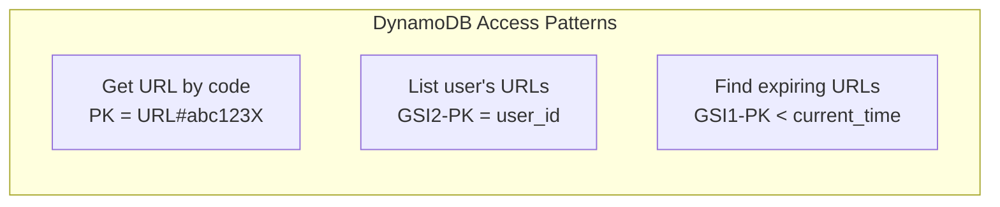

### 4. Analytics Pipeline

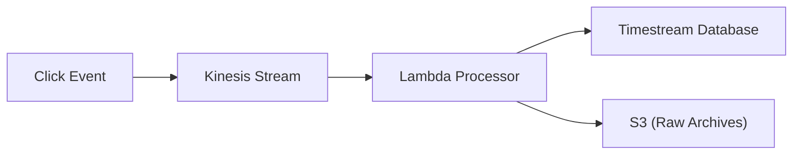

**Click Event Schema:**

```json
{
  "event_id": "uuid",
  "short_code": "abc123X",
  "timestamp": 1704067200000,
  "ip_hash": "sha256(...)",
  "country": "US",
  "region": "California",
  "city": "San Francisco",
  "referrer": "https://twitter.com",
  "user_agent": "Mozilla/5.0...",
  "device_type": "mobile",
  "browser": "Chrome",
  "os": "iOS",
  "is_bot": false
}
```

---

## Data Flow Diagrams

### URL Creation Flow

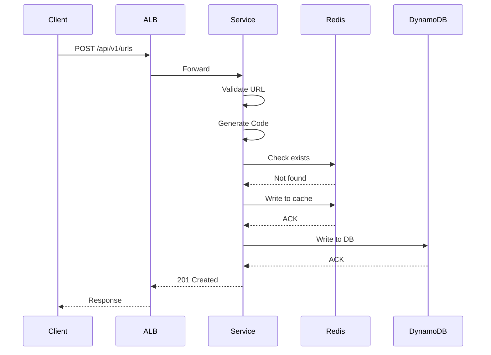

### URL Redirect Flow (Edge)

```mermaid
sequenceDiagram
    participant Client
    participant CloudFront
    participant Lambda@Edge
    participant Redis as Redis (Global)
    participant Origin as Origin (EKS)
    
    Client->>CloudFront: GET /abc123X
    CloudFront->>Lambda@Edge: Viewer Request
    Lambda@Edge->>Redis: Check Cache
    Redis-->>Lambda@Edge: Cache Hit!
    Lambda@Edge-->>CloudFront: 301 Redirect
    CloudFront-->>Client: 301 Redirect
    
    Note over Lambda@Edge,Origin: Async: Send click event
```

### Cache Miss Flow

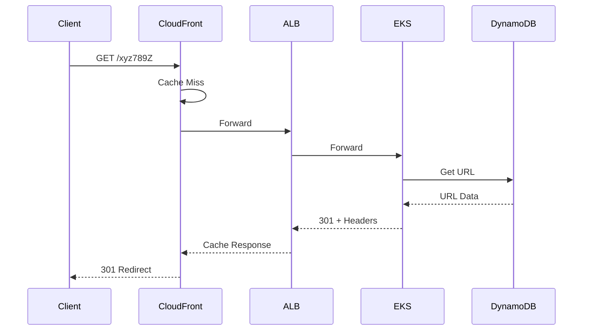

---

## Multi-Region Architecture

### Active-Active Deployment

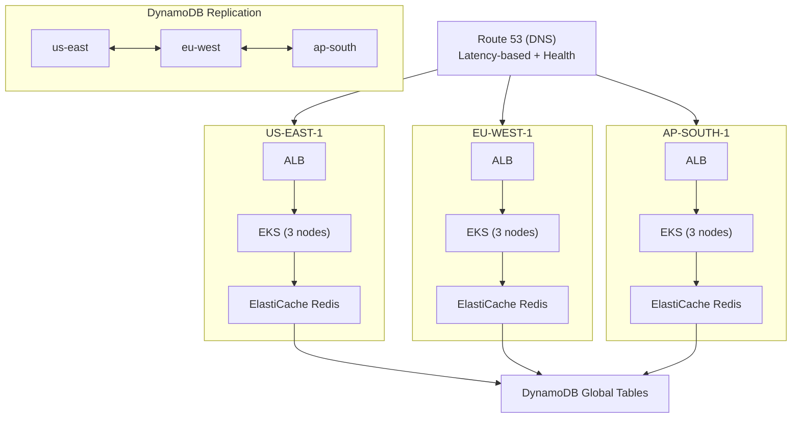

### Conflict Resolution Strategy

DynamoDB Global Tables use "last writer wins" conflict resolution. Our application handles conflicts by:

1. **URL Creation**: Short codes are unique; conflicts are impossible for generated codes
2. **Click Counts**: Use atomic counters; conflicts are resolved automatically
3. **Metadata Updates**: Timestamp-based; latest update wins
4. **Deletion**: Propagates across all regions within ~1 second

---

## Caching Strategy

### Cache Layers

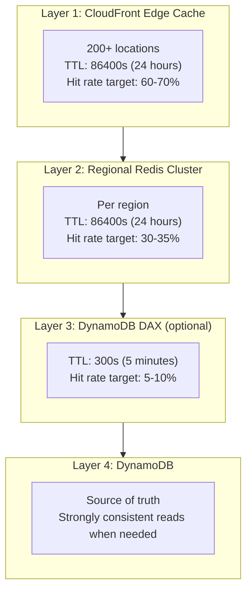

### Cache Invalidation

| Event | Invalidation Strategy |
|-------|----------------------|
| URL Deleted | Immediate invalidation at all layers |
| URL Disabled | Immediate invalidation at all layers |
| URL Updated | Write-through (update cache + DB simultaneously) |
| URL Expired | DynamoDB TTL handles removal; cache naturally expires |

---

## Security Architecture

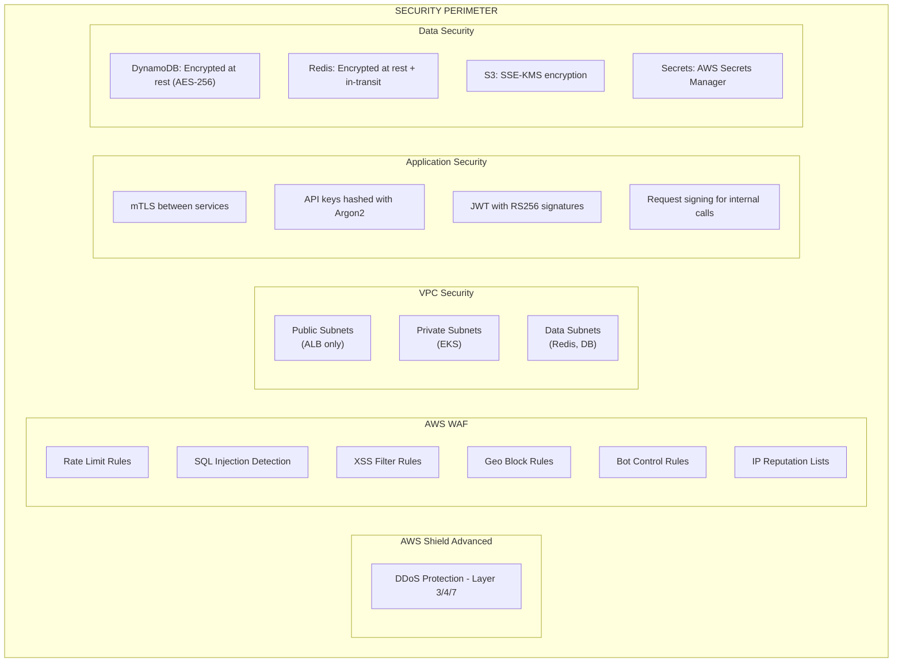

---

## ID Generation Algorithm

### Base62 Encoding

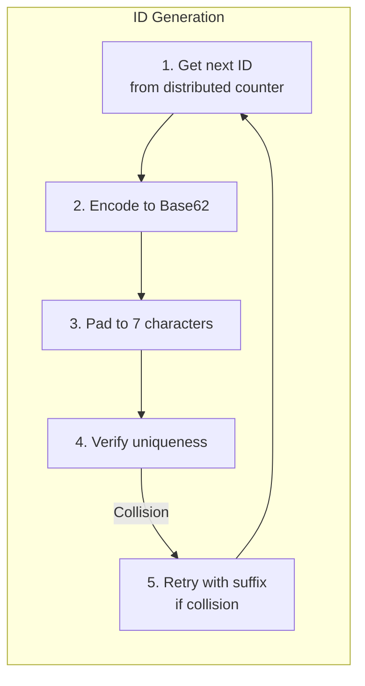

- Character set: `0-9`, `a-z`, `A-Z` (62 characters)
- 7 characters = 62^7 = **3,521,614,606,208** unique codes
- At 500M/month = 7,000 years of capacity

### Distributed Counter Implementation

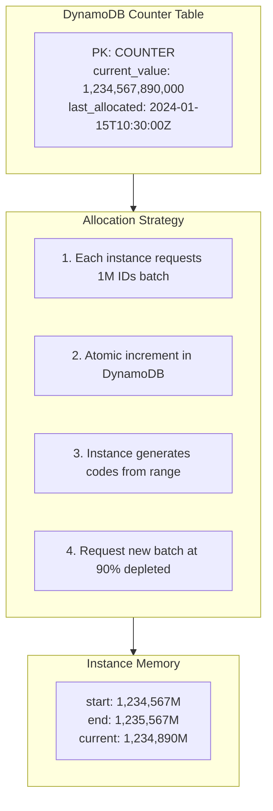

**Benefits:**
- No coordination for most writes
- Atomic operation prevents duplicates
- Predictable, sequential IDs (helps cache locality)

---

## Failure Modes and Recovery

### Failure Scenarios

| Failure | Impact | Detection | Recovery |
|---------|--------|-----------|----------|
| Single Pod | None (load balanced) | Health check | Auto-restart |
| AZ Outage | Minimal (multi-AZ) | CloudWatch | Automatic failover |
| Region Outage | Traffic shifts | Route53 health | DNS failover (~60s) |
| Redis Failure | Higher latency | Connection errors | Fallback to DB |
| DynamoDB Throttle | Requests queued | CloudWatch | Auto-scale, retry |
| CloudFront Outage | Global impact | External monitoring | AWS incident |

### Circuit Breaker Pattern

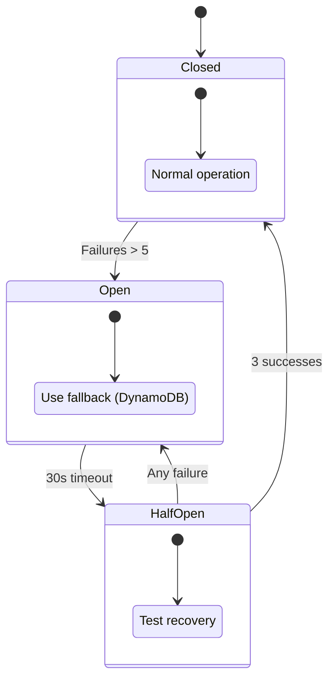

---

## Performance Optimizations

### Connection Pooling

```rust
// DynamoDB: SDK handles pooling internally
// Redis: Use connection pool
let redis_pool = Pool::builder()
    .max_size(100)           // 100 connections per instance
    .min_idle(10)            // Keep 10 warm
    .connection_timeout(Duration::from_millis(100))
    .build(redis_manager)?;
```

### Batch Operations

```rust
// Batch write to DynamoDB (up to 25 items)
dynamodb.batch_write_item()
    .request_items("urls", write_requests)
    .send()
    .await?;

// Pipeline Redis commands
let mut pipe = redis::pipe();
for code in codes {
    pipe.get(code);
}
let results: Vec<Option<String>> = pipe.query_async(&mut conn).await?;
```

### Async Everywhere

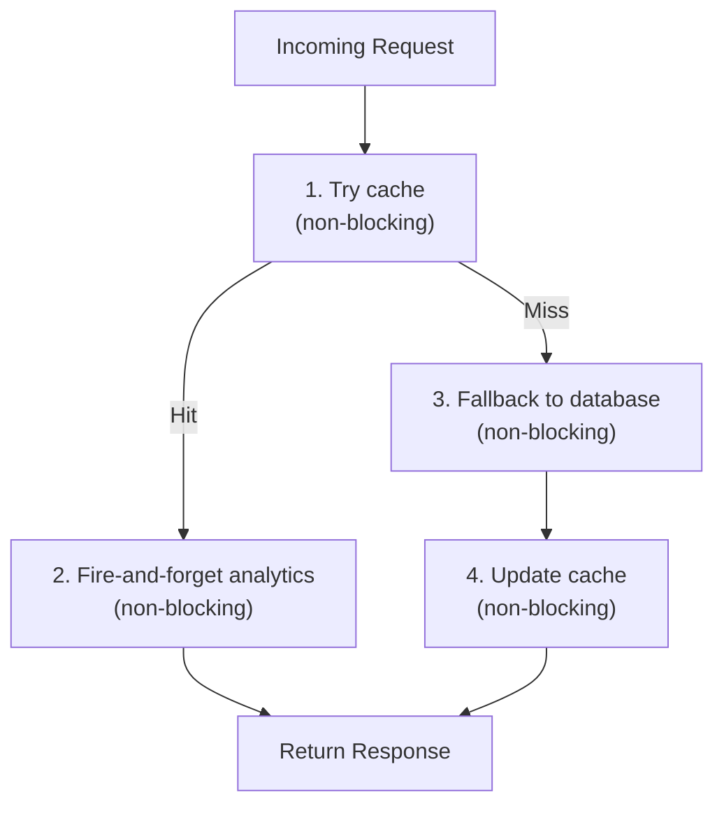
