# Database Design, Cleanup, and Purge Policies

This document covers the database schema design, data lifecycle management, cleanup strategies, and purge policies for the URL shortener system.

---

## Database Strategy by Tier

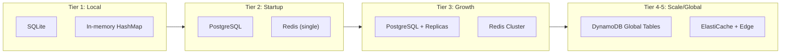

| Tier | Primary Database | Cache | Rationale |
|------|-----------------|-------|-----------|
| 1 - Local | SQLite | In-memory HashMap | Zero configuration, embedded |
| 2 - Startup | PostgreSQL | Redis (single) | Battle-tested, familiar tooling |
| 3 - Growth | PostgreSQL + Replicas | Redis Cluster | Horizontal read scaling |
| 4 - Scale | DynamoDB Global Tables | ElastiCache | Multi-region, auto-scaling |
| 5 - Global | DynamoDB Global Tables | ElastiCache + Edge | Edge caching for ultra-low latency |

---

## Tier 1-3: PostgreSQL Schema

### Core Tables

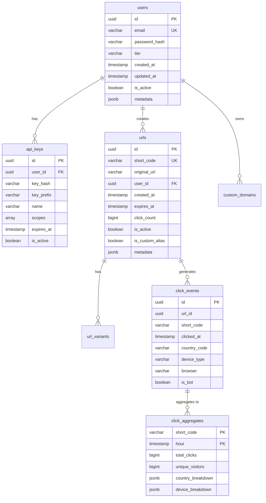

### Database Functions and Triggers

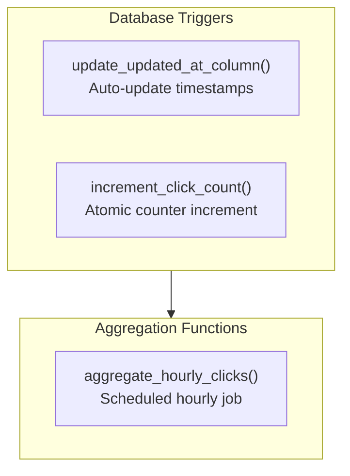

---

## Tier 4-5: DynamoDB Schema

### Table Definitions

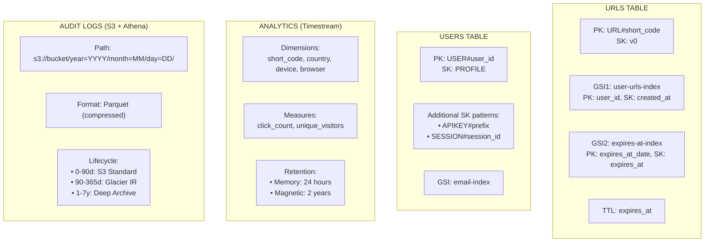

### DynamoDB Access Patterns

| Access Pattern | Key Condition | Index | Frequency |
|---------------|---------------|-------|-----------|
| Get URL by code | `pk = "URL#abc123X"` | Table | Very High |
| List user's URLs | `user_id = "xxx"` | GSI1 | Medium |
| Get user by email | `email = "user@example.com"` | GSI (users) | Medium |
| Find expiring URLs | `expires_at_date = "2024-01-15"` | GSI2 | Low (batch job) |
| Get API keys for user | `pk = "USER#xxx" AND begins_with(sk, "APIKEY#")` | Table | Medium |

---

## Cleanup and Purge Policies

### Policy Overview

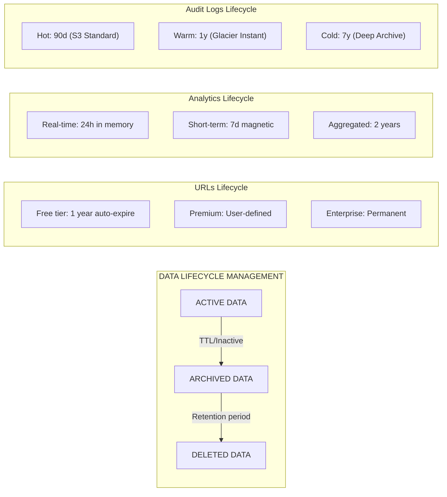

### 1. URL Expiration Policies

```yaml
url_lifecycle:
  tiers:
    free:
      default_ttl: 365d              # 1 year default
      max_ttl: 365d                  # Cannot exceed 1 year
      inactive_cleanup: 180d         # Delete if no clicks for 6 months

    premium:
      default_ttl: null              # No default expiration
      max_ttl: null                  # Unlimited
      inactive_cleanup: 730d         # 2 years inactive threshold

    enterprise:
      default_ttl: null              # No default expiration
      max_ttl: null                  # Unlimited
      inactive_cleanup: null         # Never auto-delete
```

### 2. URL States

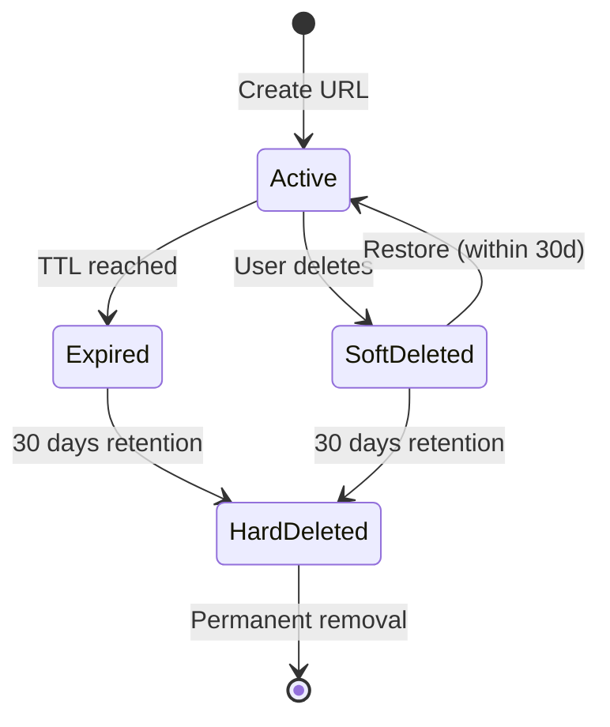

### 3. Scheduled Cleanup Jobs

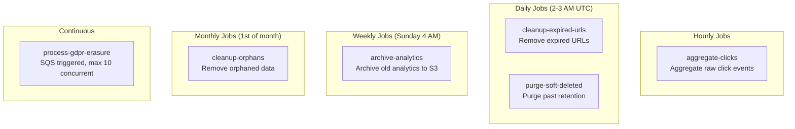

---

## GDPR Erasure Process

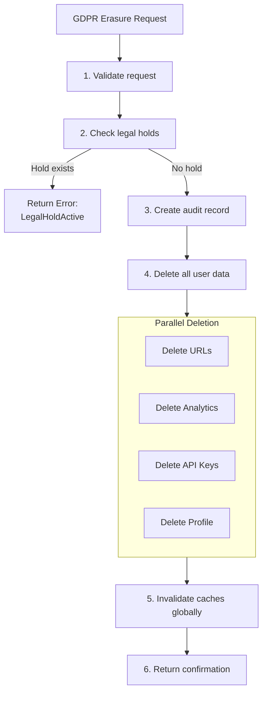

---

## Data Recovery Procedures

### Point-in-Time Recovery (PITR)

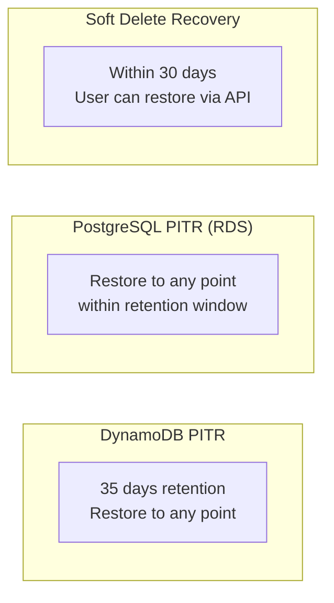

### Soft Delete Recovery Flow

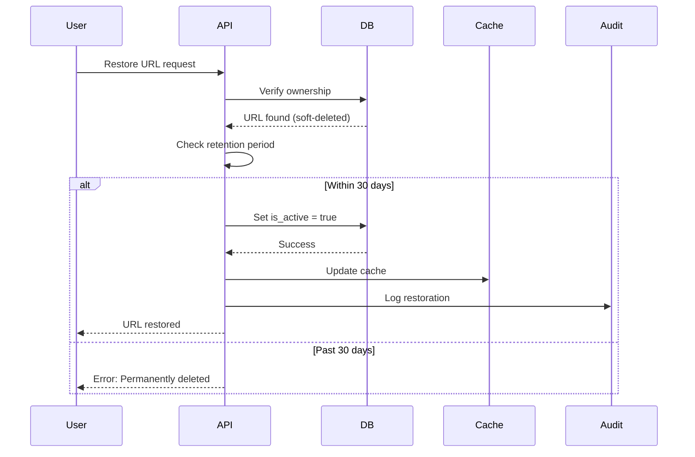

---

## Monitoring and Alerting for Data Operations

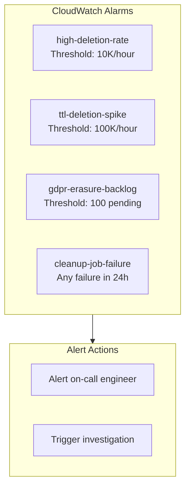
