# Security and Compliance

This document covers security architecture, threat mitigation, and compliance with GDPR, CCPA, SOC 2, and HIPAA regulations for the URL shortener system.

---

## Security Architecture Overview

```mermaid
flowchart TB
    subgraph Layer1["Layer 1: Edge Protection"]
        Shield["AWS Shield Advanced"]
        WAF["AWS WAF"]
        SignedURLs["CloudFront Signed URLs"]
        EdgeRate["Rate Limiting"]
    end

    subgraph Layer2["Layer 2: Network Security"]
        VPC["VPC"]
        PrivateSub["Private Subnets"]
        SG["Security Groups"]
        NACLs["NACLs"]
        Endpoints["VPC Endpoints"]
    end

    subgraph Layer3["Layer 3: Application Security"]
        TLS["TLS 1.3"]
        APIAuth["API Authentication"]
        InputVal["Input Validation"]
        CORS["CORS"]
        CSP["CSP Headers"]
    end

    subgraph Layer4["Layer 4: Data Security"]
        EncryptRest["Encryption at Rest"]
        EncryptTransit["Encryption in Transit"]
        KMS["Key Management"]
        Secrets["Secrets Manager"]
    end

    subgraph Layer5["Layer 5: Identity & Access"]
        IAM["IAM Roles"]
        RBAC["RBAC"]
        APIKeys["API Keys"]
        JWT["JWT Tokens"]
        SSO["SSO/SAML"]
        MFA["MFA"]
    end

    subgraph Layer6["Layer 6: Audit & Monitoring"]
        CloudTrail["CloudTrail"]
        AuditLogs["Audit Logs"]
        SIEM["SIEM"]
        Anomaly["Anomaly Detection"]
        IR["Incident Response"]
    end

    Layer1 --> Layer2 --> Layer3 --> Layer4 --> Layer5 --> Layer6
```

---

## Threat Model

### STRIDE Analysis

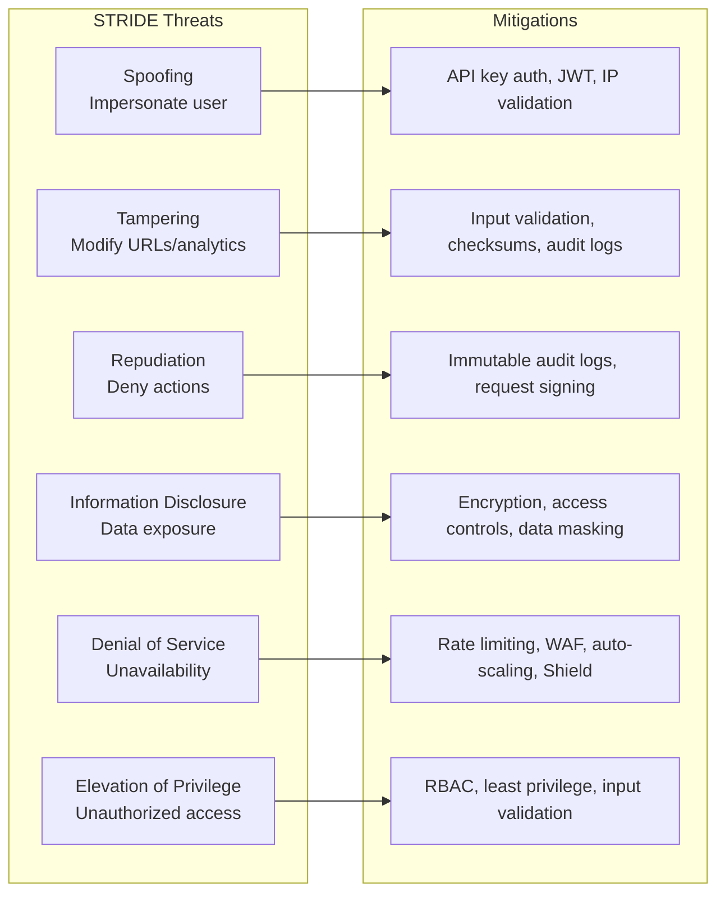

### Attack Vectors and Mitigations

```mermaid
flowchart TB
    subgraph URLCreation["1. URL Creation (/api/v1/urls)"]
        Attack1["Malicious URL injection"]
        Mit1["• URL validation<br/>• Google Safe Browsing API<br/>• Domain reputation<br/>• Rate limiting"]
        Attack1 --> Mit1
    end

    subgraph Redirect["2. Redirect Endpoint (/:code)"]
        Attack2["Open redirect vulnerability"]
        Mit2["• Validate stored URLs<br/>• No user-controlled params<br/>• Log suspicious patterns<br/>• Interstitial warning option"]
        Attack2 --> Mit2
    end

    subgraph Auth["3. Authentication"]
        Attack3["API key theft, brute force"]
        Mit3["• Argon2id hashing<br/>• Key rotation<br/>• IP allowlisting<br/>• Lockout policy<br/>• Anomaly detection"]
        Attack3 --> Mit3
    end

    subgraph DDoS["4. DDoS Attacks"]
        Attack4["Volumetric, protocol, app-layer"]
        Mit4["• AWS Shield Advanced<br/>• CloudFront absorption<br/>• WAF rate rules<br/>• Geo blocking<br/>• Auto-scaling"]
        Attack4 --> Mit4
    end
```

---

## Authentication and Authorization

### API Key Flow

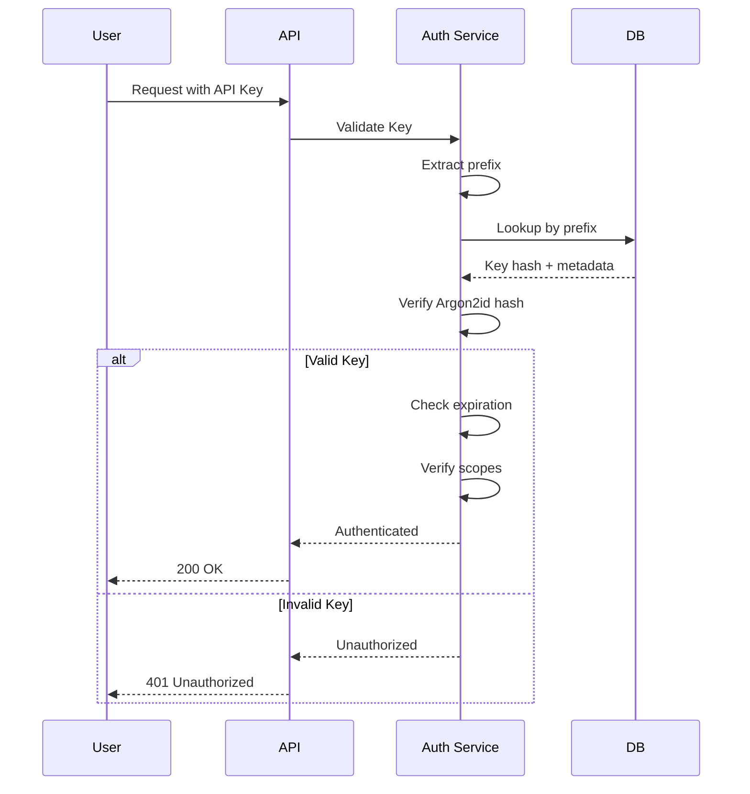

### Role-Based Access Control (RBAC)

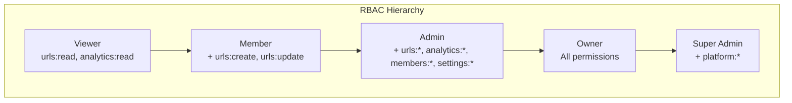

---

## Data Protection

### Encryption Standards

| Data Type | At Rest | In Transit | Key Management |
|-----------|---------|------------|----------------|
| URL Mappings | AES-256 (DynamoDB) | TLS 1.3 | AWS managed |
| User Data | AES-256 | TLS 1.3 | AWS KMS |
| API Keys | Argon2id hash | TLS 1.3 | N/A (hashed) |
| Analytics | AES-256 | TLS 1.3 | AWS managed |
| Audit Logs | AES-256 (S3 SSE-KMS) | TLS 1.3 | Customer CMK |
| Secrets | AES-256 (Secrets Manager) | TLS 1.3 | AWS KMS |

### Sensitive Data Handling

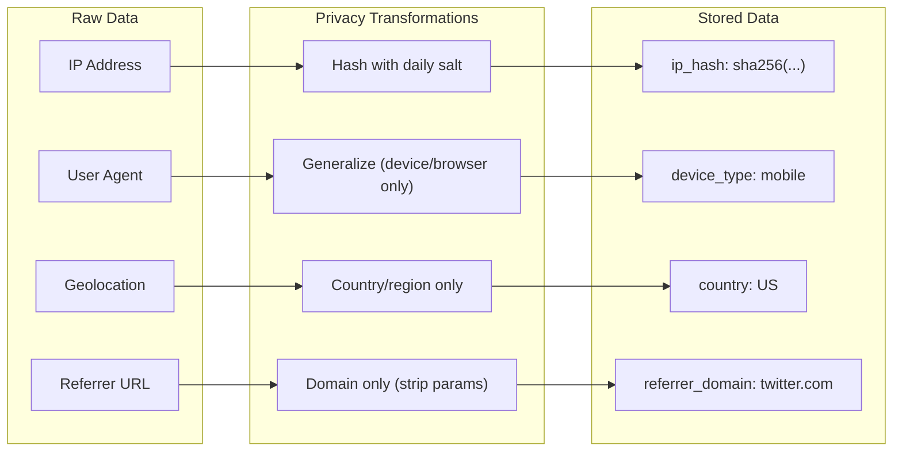

---

## Compliance Frameworks

### GDPR (General Data Protection Regulation)

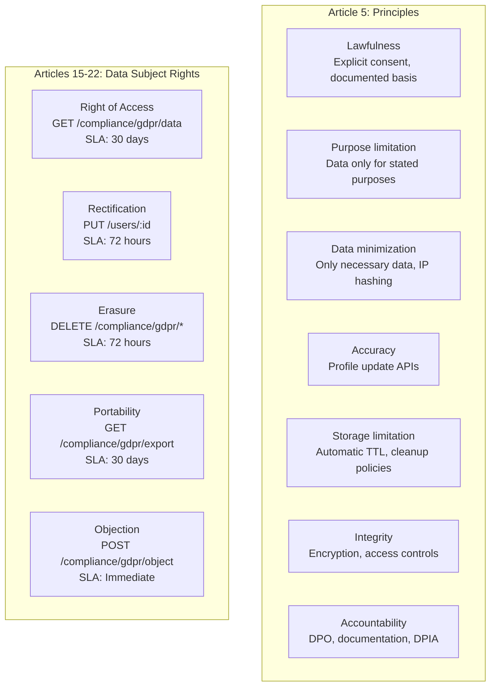

### CCPA (California Consumer Privacy Act)

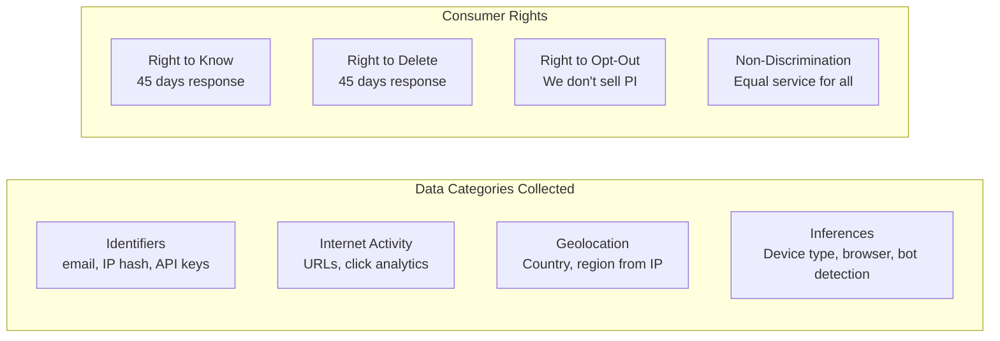

### SOC 2 Trust Principles

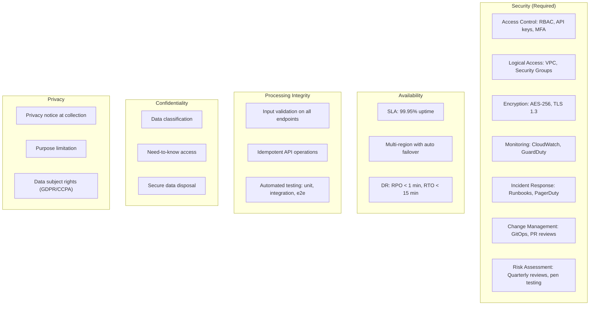

### HIPAA Compliance

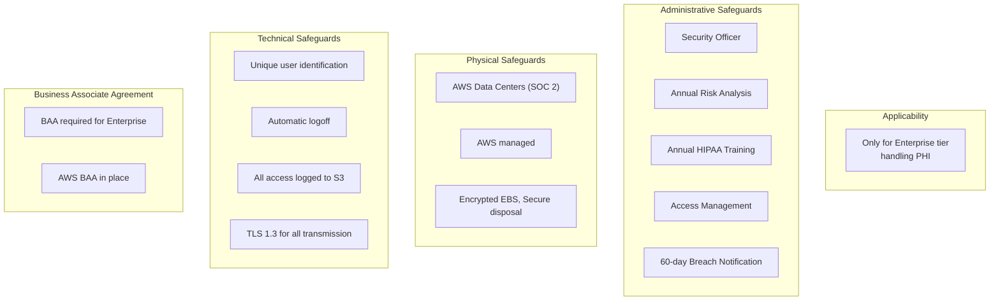

---

## AWS WAF Rules

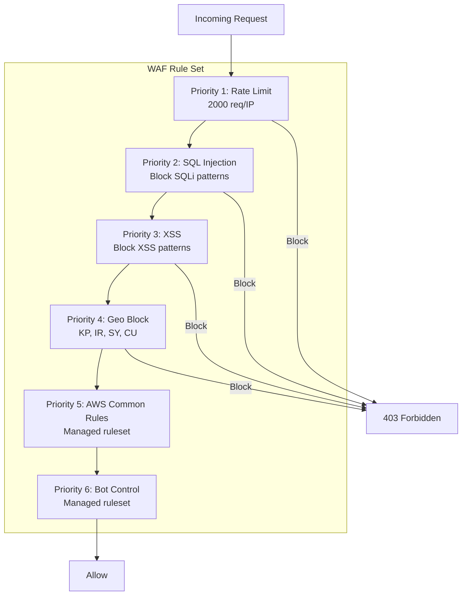

---

## Incident Response

### Security Incident Classification

| Severity | Description | Response Time | Example |
|----------|-------------|---------------|---------|
| P1 - Critical | Active breach, data exposure | 15 minutes | Data exfiltration detected |
| P2 - High | Potential breach, vulnerability exploited | 1 hour | Unauthorized access attempt |
| P3 - Medium | Security concern, no breach | 4 hours | Suspicious activity pattern |
| P4 - Low | Minor issue, no immediate risk | 24 hours | Failed login attempts |

### Incident Response Workflow

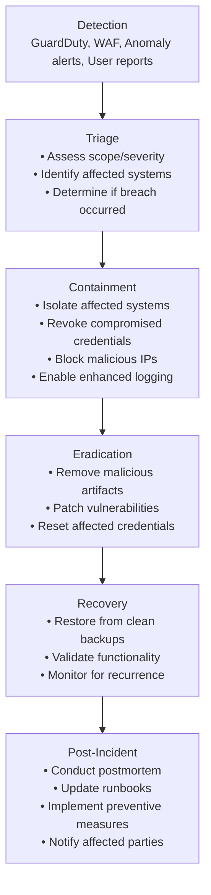

### Notification Requirements

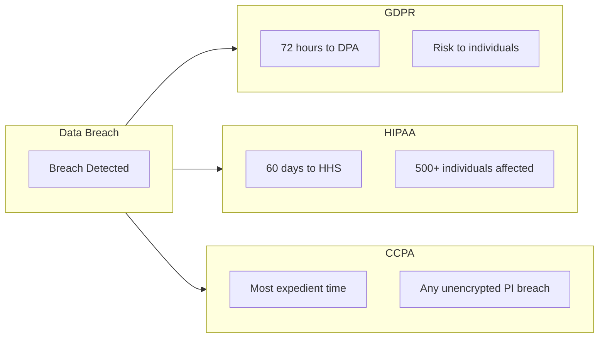

---

## Security Compliance Checklist

### Pre-Launch Security Review

- [ ] Threat model documented and reviewed
- [ ] Penetration test completed (no critical/high findings)
- [ ] Security architecture review completed
- [ ] All dependencies scanned for vulnerabilities
- [ ] Secrets management implemented (no hardcoded secrets)
- [ ] Encryption at rest and in transit verified
- [ ] Access controls tested and documented
- [ ] Audit logging functional and verified
- [ ] Incident response runbook documented
- [ ] Security monitoring and alerting configured

### Ongoing Security Operations

- [ ] Weekly vulnerability scans
- [ ] Monthly access review
- [ ] Quarterly penetration testing
- [ ] Annual security training
- [ ] Annual risk assessment
- [ ] Continuous dependency monitoring
- [ ] Regular backup and recovery testing
