# Telemetry, Observability, and Alerting

This document covers the observability strategy including metrics, logging, tracing, dashboards, and alerting for the URL shortener system.

---

## Observability Strategy

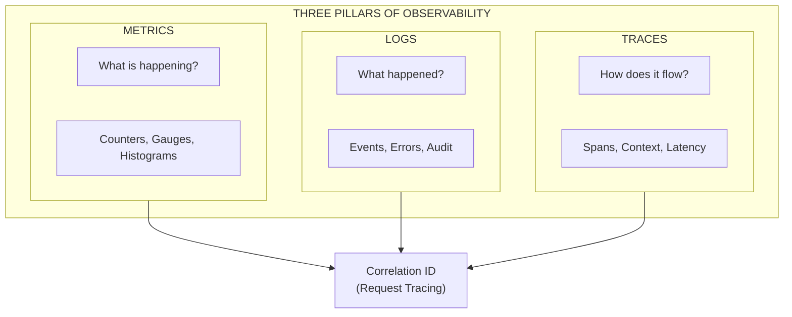

---

## Technology Stack

| Component | Technology | Purpose |
|-----------|------------|---------|
| Instrumentation | OpenTelemetry (Rust SDK) | Vendor-neutral telemetry collection |
| Metrics Backend | CloudWatch + Prometheus | Metrics storage and querying |
| Logs Backend | CloudWatch Logs + OpenSearch | Log aggregation and search |
| Traces Backend | AWS X-Ray | Distributed tracing |
| Visualization | Grafana | Dashboards and visualization |
| Alerting | CloudWatch Alarms + PagerDuty | Alert management and escalation |
| APM | AWS X-Ray + Custom Dashboards | Application performance monitoring |

---

## OpenTelemetry Integration

### Telemetry Pipeline

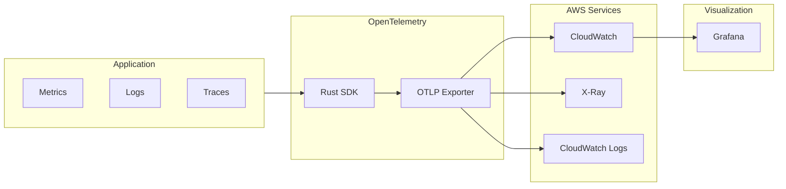

### Custom Metrics

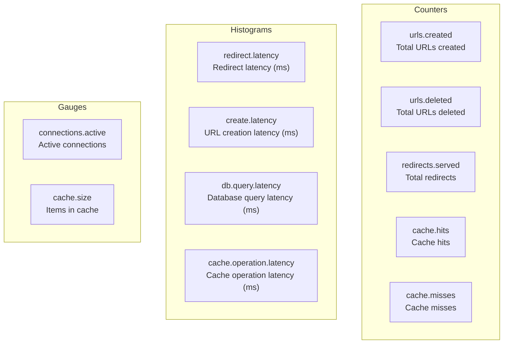

---

## Logging Strategy

### Log Levels and Usage

| Level | Usage | Example |
|-------|-------|---------|
| ERROR | Unhandled errors, system failures | Database connection failure |
| WARN | Handled errors, degraded state | Rate limit exceeded, cache miss fallback |
| INFO | Business events, request completion | URL created, redirect served |
| DEBUG | Detailed debugging info | Query parameters, cache operations |
| TRACE | Very detailed tracing | Individual function calls |

### Structured Log Format

```json
{
  "timestamp": "2024-01-15T10:30:00.123Z",
  "level": "INFO",
  "message": "URL created successfully",
  "target": "url_shortener::api::urls",
  "span": {
    "name": "create_url",
    "correlation_id": "req_abc123xyz"
  },
  "fields": {
    "short_code": "abc123X",
    "user_id": "user_uuid",
    "tier": "premium",
    "is_custom_alias": false,
    "latency_ms": 45
  },
  "trace_id": "4bf92f3577b34da6a3ce929d0e0e4736",
  "span_id": "00f067aa0ba902b7"
}
```

### Log Aggregation Pipeline

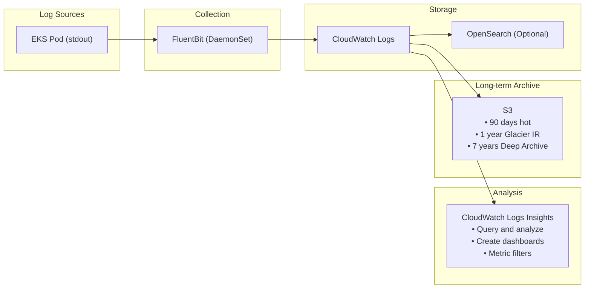

---

## Metrics and Dashboards

### Key Metrics (RED Method)

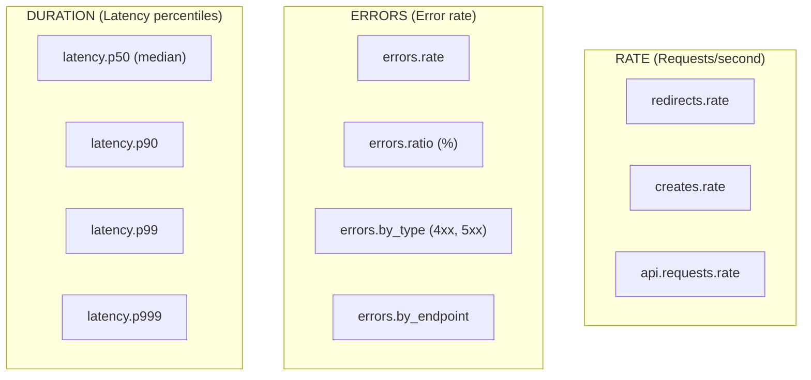

### Business Metrics

| Metric | Description | Dashboard |
|--------|-------------|-----------|
| `urls.total` | Total URLs in system | Business Overview |
| `urls.active` | Active (non-expired) URLs | Business Overview |
| `urls.created.daily` | URLs created per day | Growth Dashboard |
| `redirects.daily` | Redirects served per day | Traffic Dashboard |
| `users.active.daily` | Daily active users | User Analytics |
| `users.by_tier` | Users by subscription tier | Revenue Dashboard |
| `cache.hit_rate` | Cache hit percentage | Performance Dashboard |

### Infrastructure Metrics

| Metric | Source | Alert Threshold |
|--------|--------|-----------------|
| CPU Utilization | CloudWatch | > 80% for 5 min |
| Memory Utilization | CloudWatch | > 85% for 5 min |
| Network I/O | CloudWatch | > 80% capacity |
| DynamoDB Read Capacity | CloudWatch | > 80% consumed |
| DynamoDB Write Capacity | CloudWatch | > 80% consumed |
| Redis Memory | ElastiCache | > 75% used |
| Redis Connections | ElastiCache | > 90% max |

---

## Alerting Strategy

### Alert Severity Levels

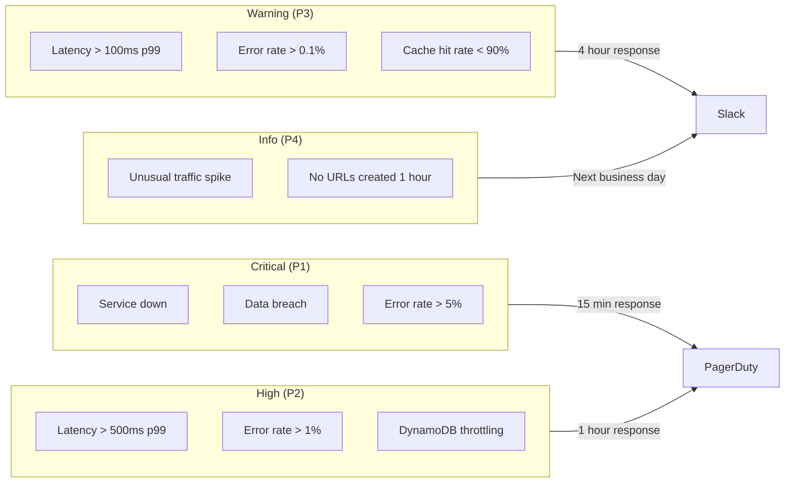

### Alert Definitions

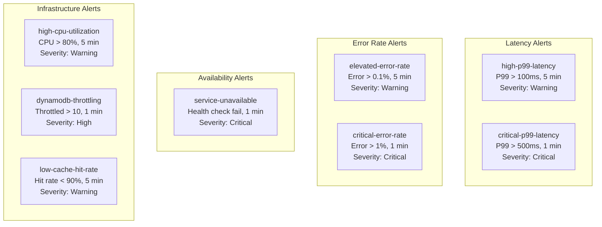

### Escalation Policy

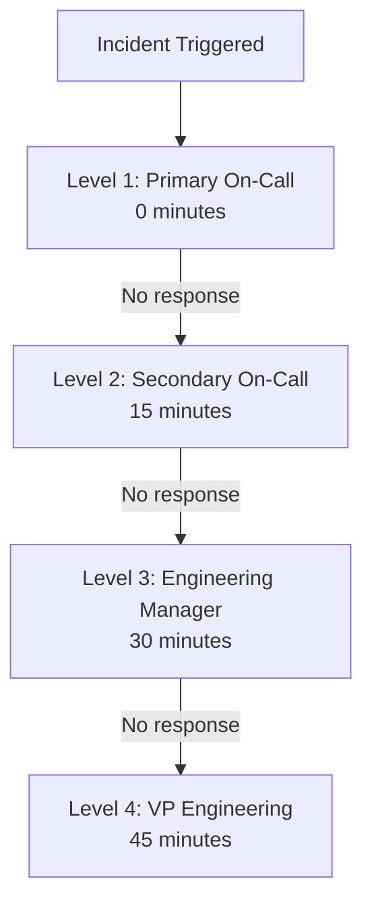

---

## Health Checks

### Health Check Endpoints

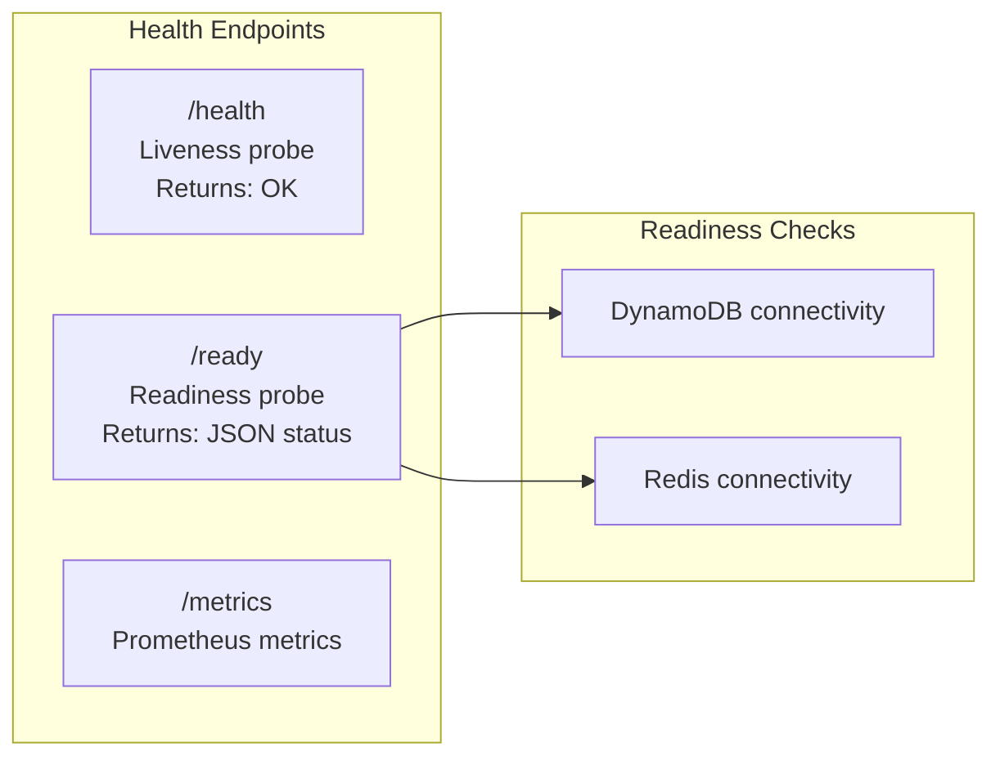

### Readiness Response

```json
{
  "status": "healthy",
  "version": "1.2.3",
  "checks": [
    {
      "name": "dynamodb",
      "status": "healthy",
      "latency_ms": 5
    },
    {
      "name": "redis",
      "status": "healthy",
      "latency_ms": 1
    }
  ]
}
```

---

## SLIs, SLOs, and SLAs

### Service Level Indicators (SLIs)

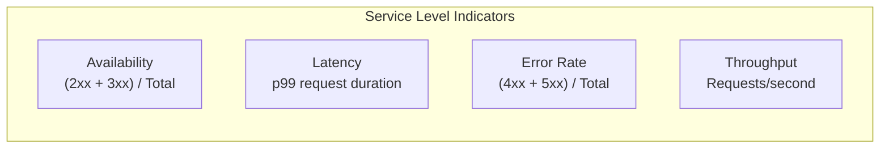

### Service Level Objectives (SLOs)

| Metric | SLO | Error Budget (monthly) |
|--------|-----|------------------------|
| Availability | 99.95% | 22 minutes |
| Redirect Latency (p99) | < 50ms | N/A |
| API Latency (p99) | < 200ms | N/A |
| Error Rate | < 0.1% | N/A |

### Error Budget Consumption

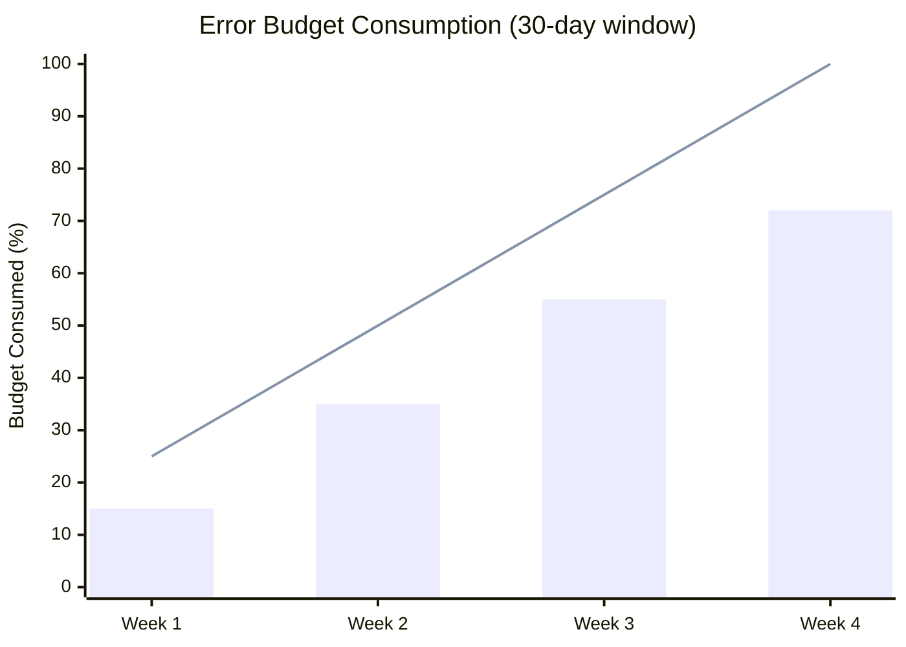

### Error Budget Alerts

| Threshold | Window | Severity | Action |
|-----------|--------|----------|--------|
| 50% consumed | 7 days | Warning | Review velocity |
| 75% consumed | 7 days | High | Slow deployments |
| 90% consumed | 7 days | Critical | Freeze deployments |
