# AWS Deployment and Infrastructure

This document covers the AWS infrastructure, deployment strategies, and Infrastructure as Code (IaC) for the URL shortener system.

---

## Infrastructure Overview

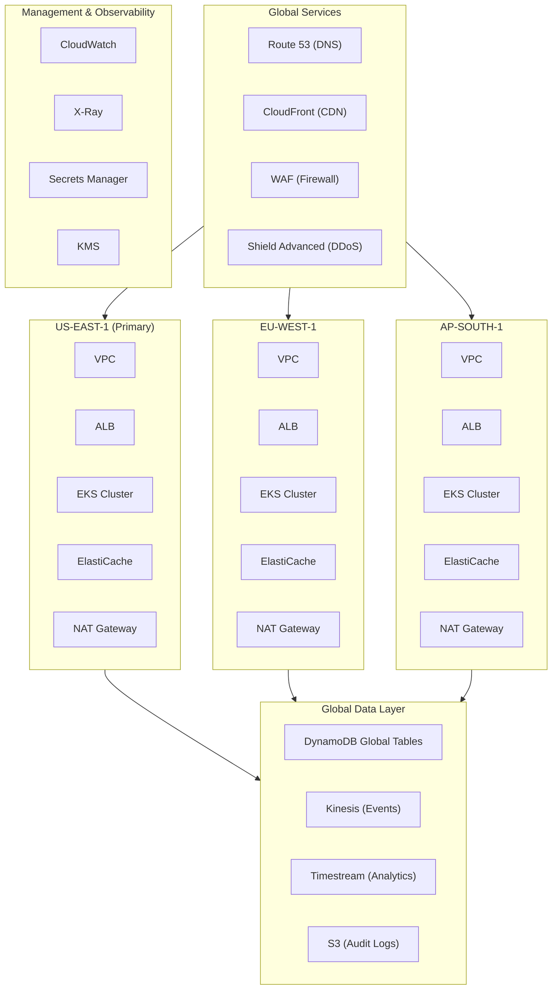

---

## Terraform Project Structure

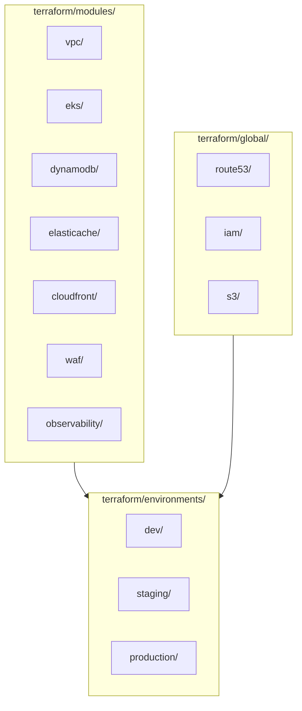

---

## Core Infrastructure Modules

### VPC Architecture

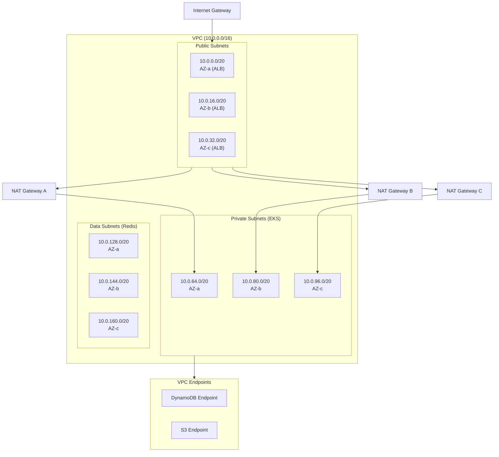

### EKS Cluster Architecture

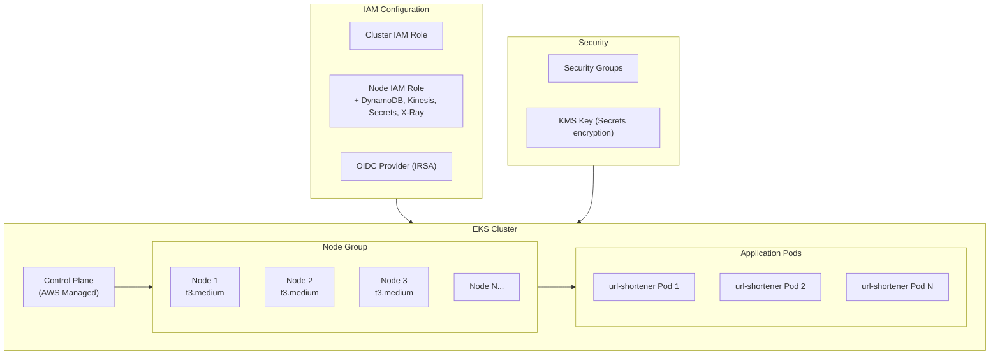

### DynamoDB Global Tables

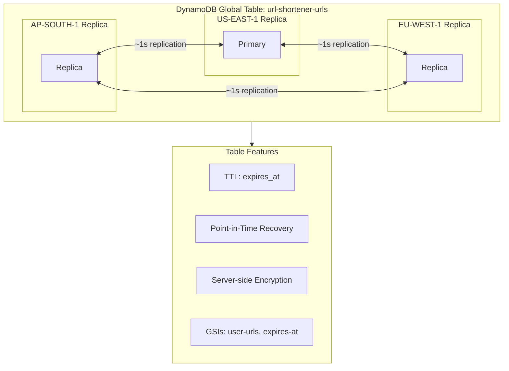

### CloudFront Distribution

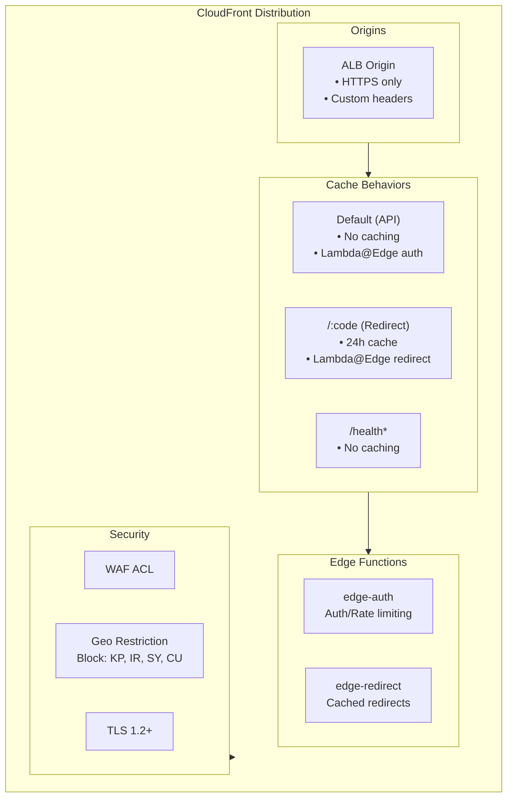

---

## CI/CD Pipeline

### GitHub Actions Workflow

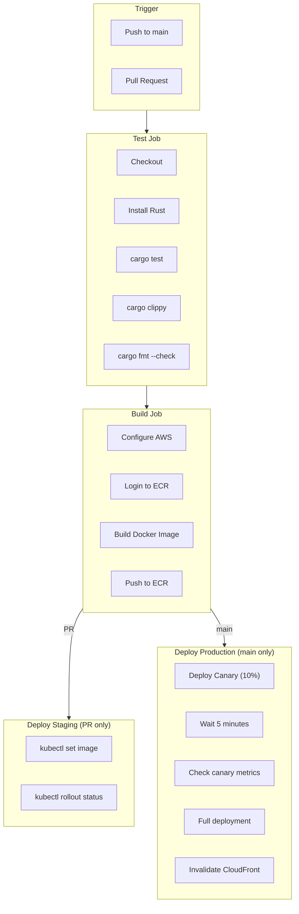

### Canary Deployment Strategy

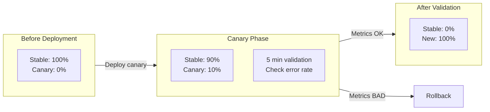

---

## Disaster Recovery

### Multi-Region Failover

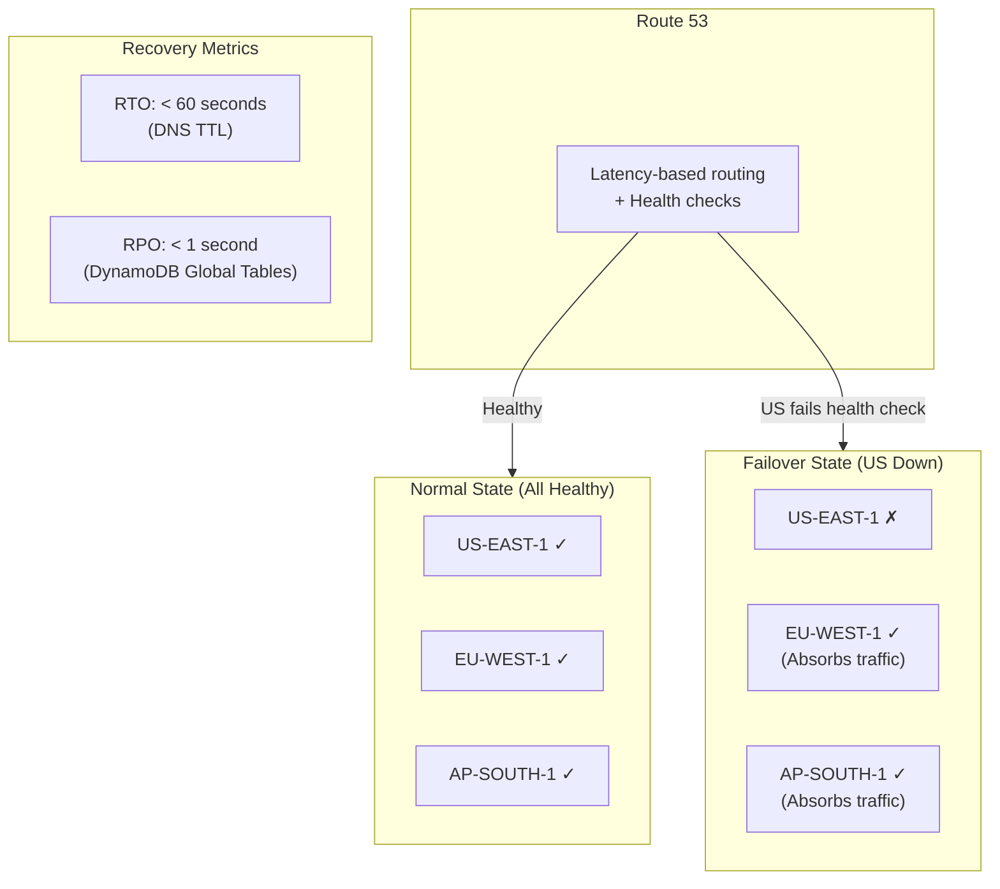

### Health Check Configuration

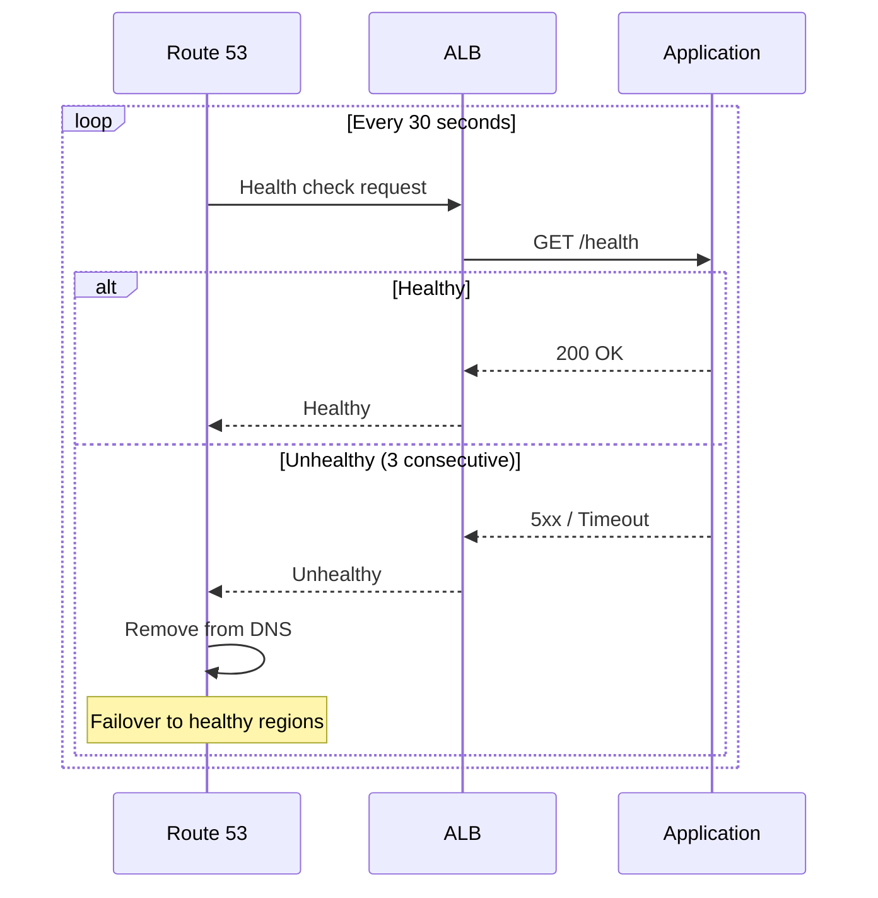

### Backup Strategy

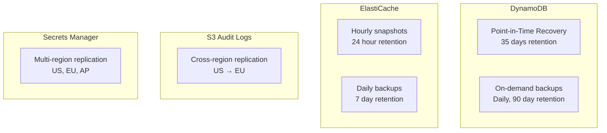

---

## Cost Optimization

### Estimated Monthly Costs (Tier 5 - 500M URLs/month)

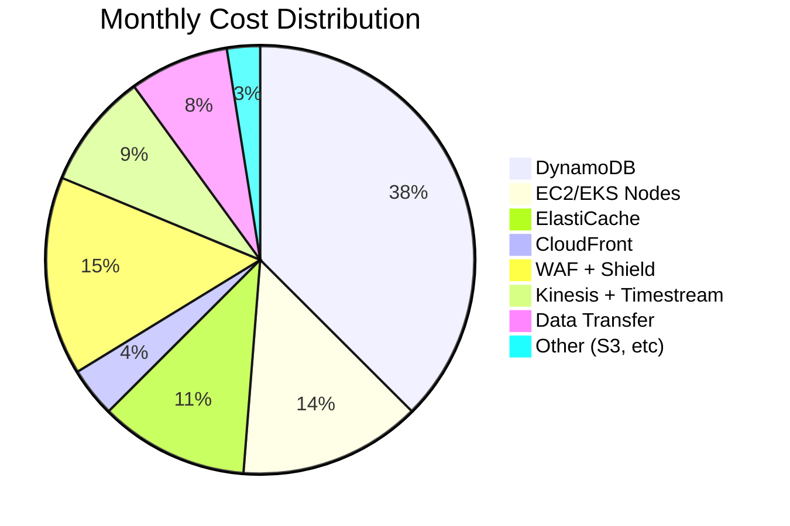

| Service | Configuration | Estimated Cost |
|---------|--------------|----------------|
| CloudFront | 1.5TB data transfer | $1,500 |
| EKS | 15 nodes (3 regions) | $3,000 |
| EC2 (Nodes) | t3.large x 15 | $2,500 |
| DynamoDB | 500M writes, 50B reads | $15,000 |
| ElastiCache | r6g.large x 9 | $4,500 |
| Kinesis | 50 shards | $1,500 |
| Timestream | Storage + queries | $2,000 |
| S3 | Audit logs + exports | $500 |
| Data Transfer | Inter-region | $3,000 |
| WAF + Shield | Advanced | $6,000 |
| **Total** | | **~$40,000/month** |

### Cost Optimization Strategies

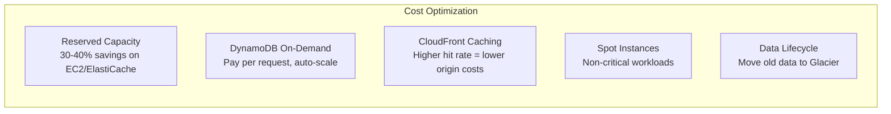
