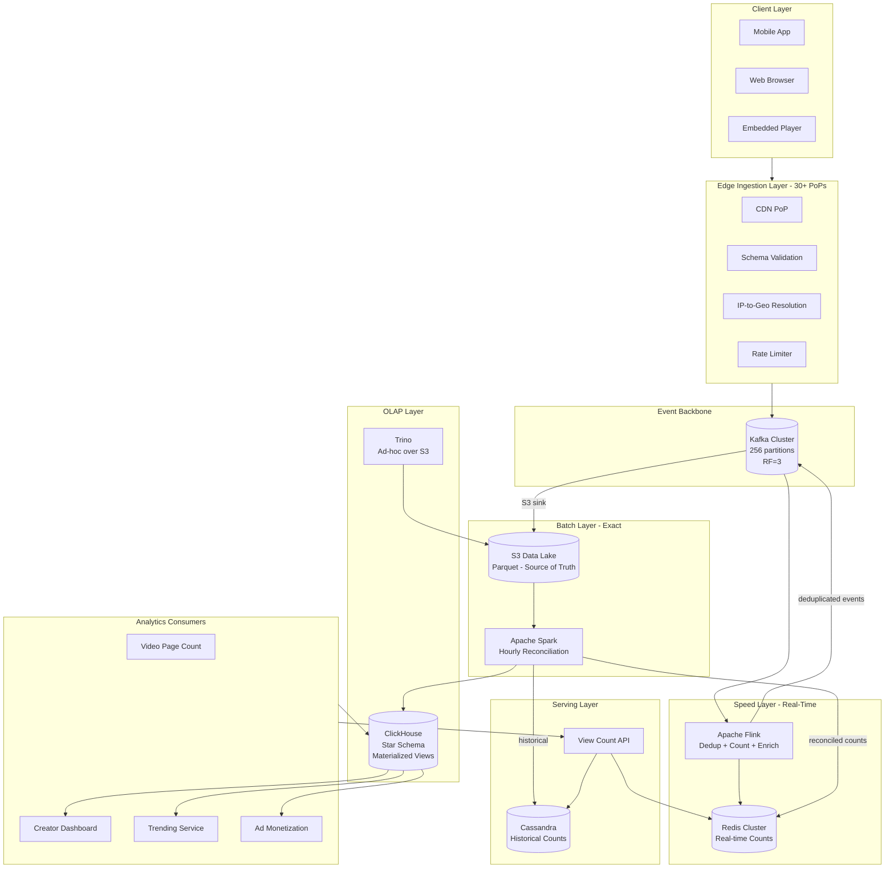
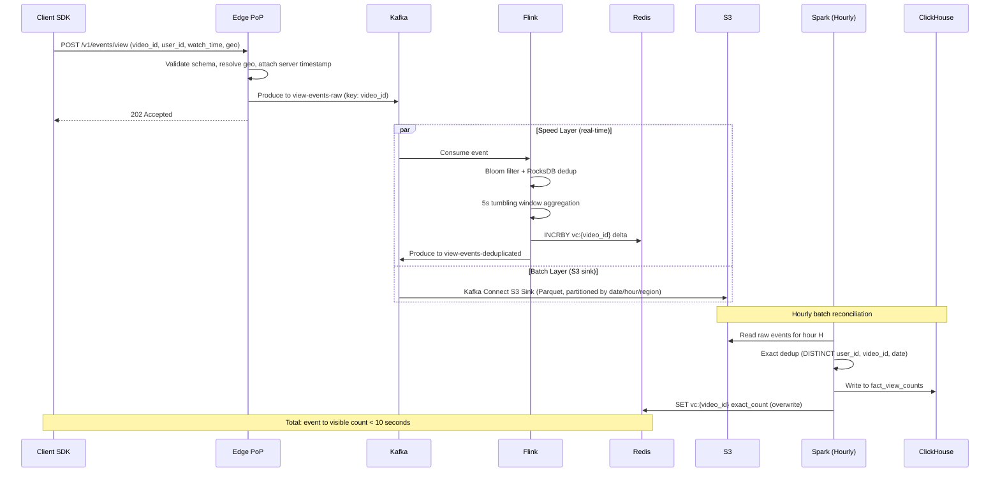

# YouTube Video Views — System Design

## Overview

A YouTube-scale video view counting and analytics system that ingests ~10B view events/day, provides near-real-time view counts (<10s freshness), and powers creator analytics dashboards with OLAP slicing across geography, device, time, and referral dimensions.

Designed for an Uber data team system design interview. Emphasis on **data engineering**: streaming pipelines, batch processing, data modeling, data quality, and cost-efficient OLAP at planetary scale.

## System Architecture (High-Level)

## End-to-End Request Flow (Happy Path)

## Scale Parameters

| Metric | Value |
|--------|-------|
| Daily view events | ~10B |
| Avg event size | ~500 bytes |
| Daily raw ingestion | ~5 TB/day |
| Avg events/sec | ~115K |
| Peak events/sec | ~500K |
| Total videos | ~1B |
| Active videos (30-day) | ~100M |
| Concurrent viewers on viral video | ~5M+ |
| Geographic regions | 100+ countries |
| Peak-to-average ratio | ~4-5x |

## Key Design Decisions

| Decision | Choice | Rationale |
|----------|--------|-----------|
| **Architecture** | Lambda (Speed + Batch) | Real-time ~99.5% accurate for UX; batch for 100% correctness |
| **Event backbone** | Kafka | Replay capability, exactly-once, handles 500K/sec |
| **Speed layer** | Apache Flink | Exactly-once, native windowed dedup, checkpointing |
| **Batch layer** | Spark + S3 | S3 is immutable source of truth; Spark handles 5TB/day |
| **Real-time store** | Redis Cluster | O(1) INCRBY, sub-ms reads, bounded working set |
| **Historical store** | Cassandra | Write-heavy, time-series friendly, partition by video_id |
| **OLAP** | ClickHouse | Sub-second on billions of rows, native Kafka ingestion, 10:1 compression |
| **Ad-hoc queries** | Trino over S3 | Full dataset access without pre-aggregation |
| **Source of truth** | S3 raw Parquet | Immutable, cheap ($23/TB/mo), enables full reprocessing |

## Technology Stack

| Layer | Technology | Purpose |
|-------|-----------|---------|
| Edge Ingestion | CloudFront Functions / Lambda@Edge | Validation, geo resolution, rate limiting |
| Event Backbone | Apache Kafka (MSK) | Event streaming, partitioned by video_id |
| Schema Registry | Confluent Schema Registry | Avro schema evolution |
| Speed Layer | Apache Flink (on EKS) | Real-time dedup, counting, enrichment |
| Batch Layer | Apache Spark (EMR/EKS) | Hourly exact reconciliation |
| Data Lake | S3 + Parquet | Immutable raw event storage |
| Real-time Store | Redis Cluster (ElastiCache) | Live view counts |
| Historical Store | Apache Cassandra | Time-series view counts |
| OLAP | ClickHouse | Pre-aggregated analytics, materialized views |
| Ad-hoc Analytics | Trino | SQL over S3 Parquet |
| Cube Management | dbt | Materialized view orchestration |
| Orchestration | Apache Airflow | Batch job scheduling |
| Observability | Prometheus + Grafana + Jaeger | Metrics, dashboards, tracing |
| Data Quality | Great Expectations | Automated data validation |

## Documentation Structure

1. [Requirements](./requirements.md) — Functional/non-functional requirements, scale parameters
2. [System Architecture](./system-architecture.md) — Component design, data flow, technology choices
3. [Data Modeling](./data-modeling.md) — Event schema, OLAP star schema, ClickHouse DDL, Cassandra schema
4. [Edge Cases](./edge-cases.md) — Virality, geo-distribution, bot detection, dedup, late events
5. [Observability](./observability.md) — Metrics, tracing, data quality, dashboards, alerting
6. [Fault Tolerance](./fault-tolerance.md) — Failure modes, recovery, graceful degradation
7. [Cost Model](./cost-model.md) — Infrastructure sizing, per-component costs, optimization levers
8. [OLAP & Analytics](./olap-analytics.md) — Query patterns, pre-computed cubes, trending, data lineage
