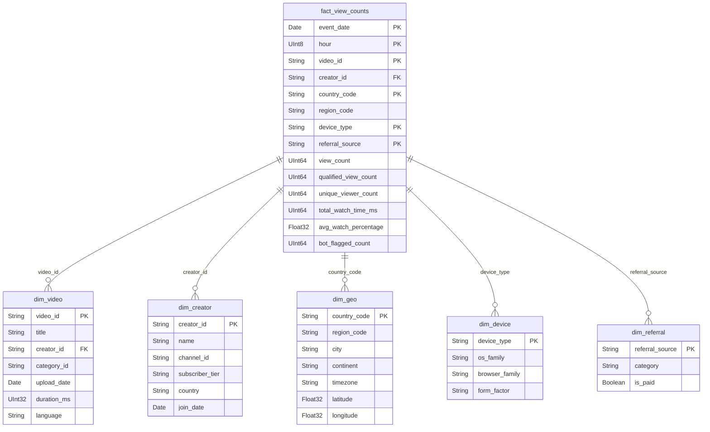

# Data Modeling

## 1. View Event Schema (Source of Truth)

The raw view event is the foundational data unit. Stored in Avro format with Schema Registry for evolution.

```
ViewEvent (Avro, registered in Schema Registry)
═══════════════════════════════════════════════

Identifiers:
  event_id             : string   UUID v7 (time-sortable for efficient indexing)
  video_id             : string   UUID
  user_id              : string   UUID (nullable for anonymous viewers)
  session_id           : string   Client session identifier
  client_dedup_token   : string   Client-generated idempotency key (UUID per view)

Temporal:
  client_timestamp     : long     Epoch milliseconds from client clock
  server_timestamp     : long     Epoch milliseconds from edge server (AUTHORITATIVE)
  event_date           : string   YYYY-MM-DD derived from server_timestamp (partition key)

Watch Behavior:
  watch_duration_ms    : int      How long the user actually watched
  video_duration_ms    : int      Total video length
  watch_percentage     : float    Derived: watch_duration / video_duration
  is_qualified_view    : bool     true if watch_duration >= 30s OR full video if < 30s

Geo & Device:
  ip_address           : string   SHA-256 hashed after geo resolution (PII protection)
  country_code         : string   ISO 3166-1 alpha-2 (e.g., "US", "IN", "DE")
  region_code          : string   ISO 3166-2 (e.g., "US-CA", "IN-MH")
  city                 : string   City name from MaxMind
  latitude             : float    Coarsened to ~10km precision (privacy)
  longitude            : float    Coarsened to ~10km precision (privacy)
  device_type          : enum     {MOBILE, DESKTOP, TABLET, TV, EMBEDDED}
  os                   : string   e.g., "iOS 18.2", "Android 15", "Windows 11"
  browser              : string   e.g., "Chrome 124", "Safari 19"

Attribution:
  referral_source      : enum     {DIRECT, SEARCH, SUGGESTED, EXTERNAL, EMBED, ADS}
  referral_url         : string   Nullable, truncated to domain only (privacy)
  creator_id           : string   Denormalized from video metadata
  category_id          : string   Denormalized from video metadata

Bot Detection Signals:
  is_bot_suspected     : bool     Set by edge layer heuristics
  bot_score            : float    0.0 = definitely human, 1.0 = definitely bot
```

**Why denormalize `creator_id` and `category_id`?**

At 10B events/day, joining with a video metadata table at query time is prohibitively expensive. Instead, we look up video metadata at the edge (cached, <1ms) and stamp it on the event. This one-time cost at ingestion saves massive compute downstream in both Flink and Spark.

**Why hash IP addresses at the edge?**

IP is PII under GDPR. We need it only for geo resolution (done at edge) and bot detection (done on the hash). Hashing at the edge means raw IPs never enter the data lake, simplifying compliance.

---

## 2. OLAP Star Schema (ClickHouse)



---

## 3. ClickHouse Table Definitions

### Fact Table: Hourly Pre-Aggregated View Counts

```sql
CREATE TABLE fact_view_counts (
    -- Dimensions
    event_date       Date,
    hour             UInt8,
    video_id         String,
    creator_id       String,
    country_code     LowCardinality(String),
    region_code      LowCardinality(String),
    device_type      LowCardinality(String),
    referral_source  LowCardinality(String),

    -- Measures
    view_count              UInt64,
    qualified_view_count    UInt64,
    unique_viewer_count     AggregateFunction(uniq, String),  -- HyperLogLog sketch
    total_watch_time_ms     UInt64,
    avg_watch_percentage    Float32,
    bot_flagged_count       UInt64
)
ENGINE = MergeTree()
PARTITION BY toYYYYMM(event_date)
ORDER BY (video_id, event_date, hour, country_code)
TTL event_date + INTERVAL 2 YEAR
SETTINGS index_granularity = 8192;
```

**Design rationale:**

| Choice | Why |
|--------|-----|
| `PARTITION BY toYYYYMM` | Monthly partitions balance partition count vs. pruning efficiency. ~24 partitions for 2-year retention. |
| `ORDER BY (video_id, event_date, hour, country_code)` | Optimized for the most common query pattern: "give me views for video X in date range Y, optionally by country." video_id first = fast point lookups. |
| `LowCardinality(String)` | country_code (~250 values), device_type (~5), referral_source (~6). Dictionary encoding reduces storage 10x and speeds scans. |
| `AggregateFunction(uniq, String)` | HyperLogLog sketch for unique viewers. Exact COUNT(DISTINCT) across billions is prohibitive. HLL gives ~2% error with constant memory. Sketches can be merged across partitions. |
| `TTL 2 YEAR` | Auto-drop old data. Aggregated cubes retain longer-term summaries. |

### Materialized View: Daily Video Rollup

```sql
CREATE MATERIALIZED VIEW mv_daily_video_views
ENGINE = SummingMergeTree()
PARTITION BY toYYYYMM(event_date)
ORDER BY (video_id, event_date, country_code)
AS SELECT
    event_date,
    video_id,
    creator_id,
    country_code,
    sum(view_count)              AS view_count,
    sum(qualified_view_count)    AS qualified_view_count,
    sum(total_watch_time_ms)     AS total_watch_time_ms,
    sum(bot_flagged_count)       AS bot_flagged_count
FROM fact_view_counts
GROUP BY event_date, video_id, creator_id, country_code;
```

### Materialized View: Creator Daily Stats

```sql
CREATE MATERIALIZED VIEW mv_creator_daily_stats
ENGINE = SummingMergeTree()
PARTITION BY toYYYYMM(event_date)
ORDER BY (creator_id, event_date)
AS SELECT
    event_date,
    creator_id,
    sum(view_count)              AS total_views,
    sum(qualified_view_count)    AS qualified_views,
    sum(total_watch_time_ms)     AS total_watch_time_ms,
    uniqMergeState(unique_viewer_count) AS unique_viewers
FROM fact_view_counts
GROUP BY event_date, creator_id;
```

### Materialized View: Trending Hourly (Short-Lived)

```sql
CREATE MATERIALIZED VIEW mv_trending_hourly
ENGINE = SummingMergeTree()
PARTITION BY toYYYYMMDD(event_date)
ORDER BY (event_date, hour, video_id)
TTL event_date + INTERVAL 3 DAY
AS SELECT
    event_date,
    hour,
    video_id,
    creator_id,
    sum(view_count)           AS view_count,
    sum(qualified_view_count) AS qualified_view_count,
    count()                   AS geo_country_count  -- proxy for geographic spread
FROM fact_view_counts
GROUP BY event_date, hour, video_id, creator_id;
```

### Why ClickHouse Over Alternatives?

| Consideration | ClickHouse | Druid | BigQuery |
|---------------|-----------|-------|----------|
| Insert throughput | ~1M rows/sec/node | ~100K rows/sec | Batch-oriented |
| Query latency (aggregation) | Sub-second on billions | Sub-second | Seconds |
| Cost at 10B events/day | ~$15K/mo (self-hosted) | ~$25K/mo | ~$50K/mo (on-demand) |
| Operational complexity | Medium | High (ZooKeeper dependency) | Low (managed) |
| Real-time ingestion | Native Kafka engine | Native Kafka indexing | Streaming insert (limited) |
| Compression | Excellent (10:1 typical) | Good | Excellent |
| Materialized views | Native, auto-maintained | Limited | Scheduled queries |
| SQL support | Full SQL + extensions | SQL-like (Druid SQL) | Full SQL |

**ClickHouse wins** on the combination of insert throughput, query speed, and cost. The main trade-off is operational complexity vs. BigQuery, which is acceptable for a team with data infrastructure expertise (Uber data team context).

---

## 4. Cassandra Schema (Historical View Counts)

### Video View Counts (Primary Access Pattern)

```sql
-- Partition by video_id, cluster by date for time-range queries
CREATE TABLE video_view_counts (
    video_id       UUID,
    date           DATE,
    hour           TINYINT,
    total_views    COUNTER,
    PRIMARY KEY ((video_id), date, hour)
) WITH CLUSTERING ORDER BY (date DESC, hour DESC)
  AND compaction = {
    'class': 'TimeWindowCompactionStrategy',
    'compaction_window_size': 1,
    'compaction_window_unit': 'DAYS'
  }
  AND default_time_to_live = 31536000;  -- 1 year
```

**Why `CLUSTERING ORDER BY date DESC`?** Most queries want recent data first ("show me views for the last 7 days"). Descending order avoids scanning past old data.

**Why `TimeWindowCompactionStrategy`?** View count data is time-series. TWCS groups SSTables by time window, reducing compaction overhead and read amplification for time-range queries.

### Creator Video Views (Reverse Lookup)

```sql
-- Reverse lookup: creator → videos sorted by views
CREATE TABLE creator_video_views (
    creator_id  UUID,
    date        DATE,
    video_id    UUID,
    total_views BIGINT,
    PRIMARY KEY ((creator_id, date), total_views, video_id)
) WITH CLUSTERING ORDER BY (total_views DESC, video_id ASC);
```

**Access pattern:** "Show creator X their top videos for date Y, ordered by views." The clustering key `(total_views DESC)` makes this a single partition scan with no sorting needed.

### Why Cassandra for This (Not PostgreSQL)?

| Requirement | Cassandra | PostgreSQL |
|-------------|-----------|------------|
| Write throughput (50K/sec batch bursts) | Native, linear scaling | Needs sharding (Citus) |
| Partition by video_id | First-class concept | Manual partitioning |
| Time-series queries | TWCS compaction, clustering order | Partitioning by date, less natural |
| Operational at 3 regions | Multi-DC replication built-in | Complex (Patroni + custom) |
| Total dataset (18TB+) | Commodity NVMe, no problem | Expensive at this scale |

Cassandra is purpose-built for this workload: high write throughput, partition-key access, time-series clustering, multi-DC replication.
