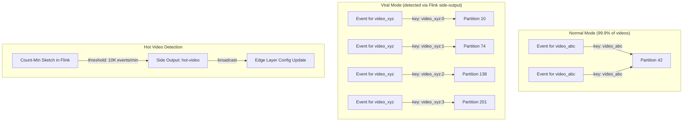
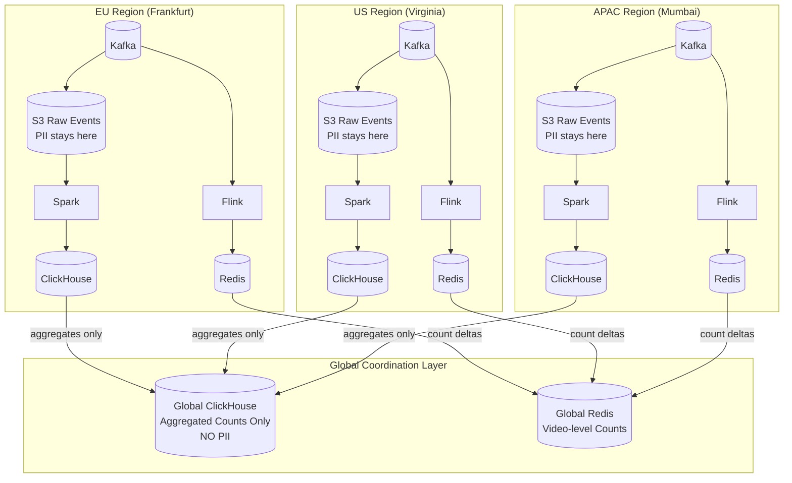
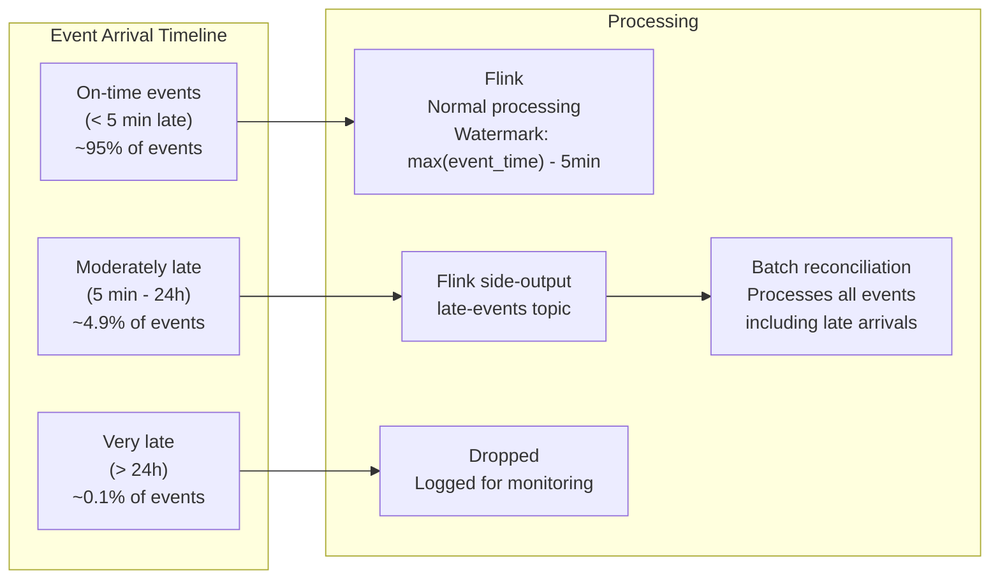

# Edge Cases & Distributed Systems Challenges

## 1. Viral Video Problem

### The Scenario: "MrBeast Drops a Video"

A viral video goes from 0 to 50M views in 30 minutes. This creates cascading problems across every layer of the system.

### Problem 1: Kafka Hot Partition

All events for one `video_id` land on one partition (by design, for dedup correctness). A viral video overwhelms that single partition and its broker.

**Mitigation: Dynamic Salted Partitioning**



```
Normal video:
  partition_key = video_id
  → All events on 1 partition (fine at low volume)

Viral video (detected via Flink Count-Min Sketch, >10K events/min):
  partition_key = video_id + ":" + (murmur3(user_id) % salt_factor)
  salt_factor = 4 (medium viral) or 16 (extreme viral, e.g., live event)
  → Events spread across salt_factor partitions
  → Counters merged at serving layer

Detection latency: ~30 seconds from spike to salt activation
Edge layer picks up new salt config via Kafka broadcast channel
```

### Problem 2: Redis Counter Contention

Single `INCRBY` key getting 100K+ increments/sec → CPU hotspot on one Redis shard.

**Mitigation: Local Aggregation + Batched Writes**

```
Flink task manager (local aggregation):
  - Accumulates counts in 5-second tumbling windows
  - ONE INCRBY per video per window per task manager
  - 20 Flink TMs × 1 write/5s = 4 writes/sec to Redis
    (vs. 100K raw writes/sec without aggregation)

For extreme cases (>1M views/min):
  - Redis key sharded: vc:{video_id}:shard:{0..7}
  - Read path: MGET all 8 shards → sum client-side
  - Amortized: ~500 writes/sec/shard (well within Redis capacity)
```

### Problem 3: Read Thundering Herd

Viral video page gets millions of concurrent viewers all hitting `GET /views`.

**Mitigation: Multi-Layer Caching with Stale-While-Revalidate**

```
Layer 1: CDN edge cache
  TTL: 5 seconds
  stale-while-revalidate: 10 seconds
  → 95% of reads never reach origin

Layer 2: API-level request coalescing
  TTL: 2 seconds
  Concurrent cache misses coalesced into single Redis read
  → Prevents stampede on cache expiry

Layer 3: Redis (always fresh from Flink flushes every 5s)

Impact analysis for 5M concurrent viewers:
  Without caching: 5M reads/sec to Redis → IMPOSSIBLE
  With caching:    ~200 reads/sec to Redis (1 per CDN PoP per TTL) → trivial
```

---

## 2. Geo-Distribution Challenges

### Clock Skew Across Regions

Users in Tokyo, London, and New York fire events with different server timestamps due to NTP drift across edge PoPs. A view at 23:59:59 UTC might be attributed to the wrong day.

**Mitigation:**
- Edge servers use GPS-synced NTP (Chrony) — drift < 1ms
- Events carry both `client_timestamp` and `server_timestamp`
- Batch reconciliation uses **event-time windowing**, not processing-time
- Daily boundary handling: events from 23:55-00:05 UTC are double-written to both days during the raw S3 sink. The batch dedup job handles this by deduplicating on `(user_id, video_id, date)`, so the double-write doesn't inflate counts.

### Cross-Region Dedup

A user starts watching on their phone in Delhi, boards a flight, lands in Singapore, finishes watching on hotel WiFi. Two different edge PoPs, two events, same view.

**Mitigation:**
```
Dedup key: (user_id, video_id, floor(server_timestamp / 12h))

This works because:
  - Same user + same video + same 12-hour window = one view
  - Regardless of which edge PoP received the event
  - Flink dedup is partitioned by video_id, so both events
    route to the same Flink task manager
  - The 12h window covers any reasonable session duration
  - Batch layer uses daily granularity: (user_id, video_id, date)
```

### Regional Data Residency (GDPR, Data Sovereignty)

EU user events may not leave the EU. Chinese user data must stay in mainland China. This is a legal requirement, not a preference.



**What crosses regional boundaries:**
```
CROSSES:  (video_id, region, hour, view_count, watch_time_ms)
          Pre-aggregated, anonymized counts — no PII

NEVER CROSSES:  (user_id, ip_address, session_id, lat/lng, city)
                Raw events — always stay in origin region
```

**Implementation detail:** Each region runs its own complete pipeline (Kafka → Flink → S3 → Spark → ClickHouse). Regional aggregates are published to a global Kafka topic containing only `(video_id, region, hour, count)` tuples. The global ClickHouse instance consumes this topic for cross-region analytics.

---

## 3. Bot Detection & View Fraud

Ad monetization makes view fraud a billion-dollar problem. A multi-layered approach:

### Layer 1: Edge Heuristics (Real-Time, Blocks ~80% of Bots)

```
Signals checked at the edge PoP:
  - Rate: >50 view events/min from same IP → flag and rate-limit
  - IP reputation: Known bot IP/ASN blocklists (updated hourly from threat intel feeds)
  - Fingerprint: Missing or malformed browser fingerprint → flag
  - TLS: JA3/JA4 hash mismatch (e.g., claims Chrome but TLS fingerprint is curl) → flag
  - Headers: Missing standard browser headers (Accept-Language, etc.) → flag

Action: Set is_bot_suspected=true, bot_score on the event
  - Score > 0.9: DROP event at edge (never enters Kafka)
  - Score 0.5-0.9: Allow but flag for downstream analysis
  - Score < 0.5: Pass through normally
```

### Layer 2: Flink Behavioral Analysis (Near-Real-Time, Catches ~15%)

```
Flink maintains per-user session state and detects:

  Unnatural watch patterns:
    - Exact same watch_duration_ms across 10+ different videos → bot
    - Always watching exactly 31 seconds (just over the 30s threshold) → bot

  Session anomalies:
    - 100 different videos in 5 minutes → bot
    - No pause/seek/interaction events (if available) → suspicious

  Geographic impossibility:
    - Same user_id with views from 3 continents in 10 minutes → bot or shared account
    - Velocity check: distance / time > 900 km/h → flag

  Referral pattern:
    - 100% of views from single referral source with identical referral_url → botnet

Output: Updated bot_score on deduplicated events
```

### Layer 3: Batch ML Model (Offline, Catches Remaining ~5%)

```
Trained on labeled bot/human dataset (manual review + known bot campaigns)

Features:
  - Session entropy (how random is the viewing pattern?)
  - Watch time distribution (humans have a natural distribution; bots are uniform)
  - Device diversity (real users switch devices; bot farms use one)
  - Temporal patterns (real users have sleep cycles; bots don't)
  - Network patterns (ASN diversity, IP rotation patterns)
  - Engagement patterns (likes, comments, subscribes correlated with views?)

Model: Gradient Boosted Trees (XGBoost) — interpretable, fast inference
Runs during hourly batch reconciliation
Output: bot_score per event

Threshold:
  bot_score > 0.8: Excluded from monetization counts
  bot_score 0.5-0.8: Flagged for human review
  bot_score < 0.5: Counted as legitimate
```

**The critical asymmetry (interview differentiator):**

False negatives (missing a bot) → cost advertiser trust and ad revenue credibility.
False positives (flagging a human as bot) → enrage creators, lose talent.

The system must err toward flagging, but provide a **creator appeal workflow** backed by human review. Flagged views are NOT deleted (audit trail) — they're excluded from qualified counts but can be reinstated on appeal.

---

## 4. Idempotency & Exactly-Once Semantics

Network retries, client reconnects, Kafka rebalances, and Flink restarts can all cause duplicate event delivery. Four layers of dedup, each catching what the previous missed:

| Layer | Mechanism | Dedup Key | Window | Accuracy | Cost |
|-------|-----------|-----------|--------|----------|------|
| **Client** | `client_dedup_token` (UUID per view session) | Token (exact) | Session lifetime | Exact | Free (client generates) |
| **Edge** | Redis `SET NX` with TTL on dedup token | `client_dedup_token` | 5 minutes | Exact, short window | Cheap (small keys, short TTL) |
| **Flink** | Bloom + RocksDB keyed state | `(user_id, video_id, 12h window)` | 12 hours | ~99.5% (Bloom FP) | Medium (stateful processing) |
| **Batch** | Spark `SELECT DISTINCT` | `(user_id, video_id, date)` | 24 hours | 100% (exact) | Expensive (full scan) |

**Why four layers?**
- Client dedup catches browser refresh / double-click
- Edge dedup catches network retry before Kafka
- Flink dedup catches Kafka redelivery + semantic dedup (same user, different session)
- Batch catches everything else and is the final arbiter

---

## 5. Late-Arriving Events

Events can arrive minutes or hours late — mobile apps in airplane mode, network partitions, client SDK batching.



**Flink watermark strategy:**
```
Watermark = max(event_time) - 5 minutes (allowed lateness)

Events within 5 min late:
  → Processed normally by Flink, counts updated in real-time
  → Window fires late update, Redis INCRBY applied

Events 5 min to 24 hours late:
  → Routed to "late-events" Kafka side-output topic
  → NOT counted in real-time (would require re-opening closed windows)
  → Picked up by batch reconciliation in next hourly run
  → Batch reads full hour from S3 (which includes late arrivals via S3 sink)

Events > 24 hours late:
  → Dropped from processing pipeline
  → Logged to dead-letter queue for monitoring
  → Alert if rate exceeds 0.1% (indicates client SDK buffering issue)
```

**Why 5 minutes, not longer?** Wider watermarks mean more state in Flink (keeping windows open longer) and delayed output. 5 minutes catches 95% of late events in the fast path. The batch layer (which has no latency constraint) handles the remaining 5%.

---

## 6. Anonymous Viewers

Not all viewers are logged in. Anonymous viewers have `user_id = null`, which breaks the `(user_id, video_id)` dedup key.

**Mitigation:**
```
For anonymous viewers:
  dedup_key = (fingerprint_hash, video_id, 12h_window)

  fingerprint_hash = SHA-256(
    IP address +
    User-Agent string +
    Accept-Language header +
    Screen resolution (if available from client SDK)
  )

Trade-offs:
  - Less accurate than user_id dedup (shared computers, VPNs)
  - But catches the obvious cases (same browser, same video, same session)
  - Batch layer further deduplicates using more signals
  - Anonymous views counted separately in analytics (dim_referral.is_authenticated)
```

---

## 7. Live Streams

Live streams break the "video has a fixed duration" assumption. A 6-hour live stream generates continuous view events.

**Handling:**
```
For live streams (video_duration_ms = null or > 3600000):
  - Qualified view: >=30 seconds of watch time (same as VOD)
  - View events fired periodically (every 60 seconds of watch time)
  - Dedup window: 12 hours (same as VOD)
  - A user watching a 6-hour live stream = 1 view, not 360 events
  - The 360 heartbeat events contribute to watch_time aggregation
    but only the first qualifies as a "view"

  Event types distinguished:
    event_type = VIEW_START     → counted as a view (if qualified)
    event_type = VIEW_HEARTBEAT → contributes to watch_time only
    event_type = VIEW_END       → finalizes watch_duration_ms
```
