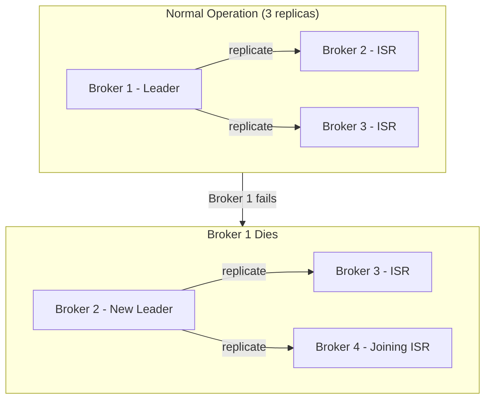
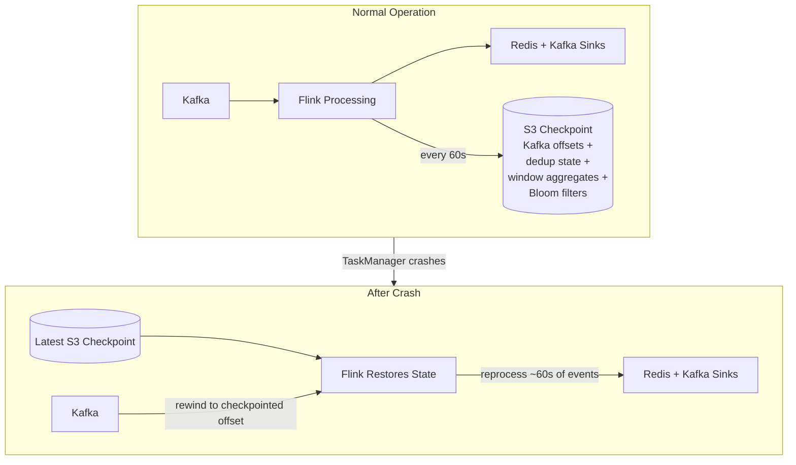
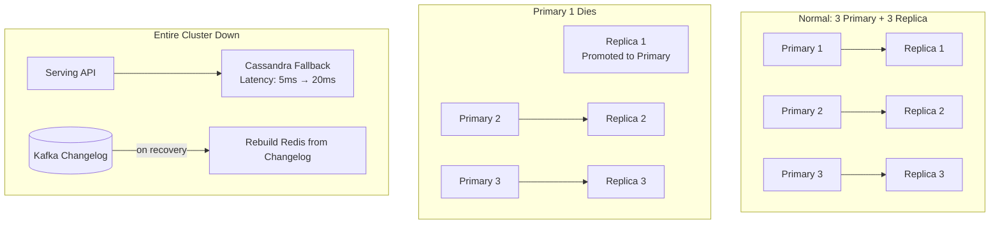
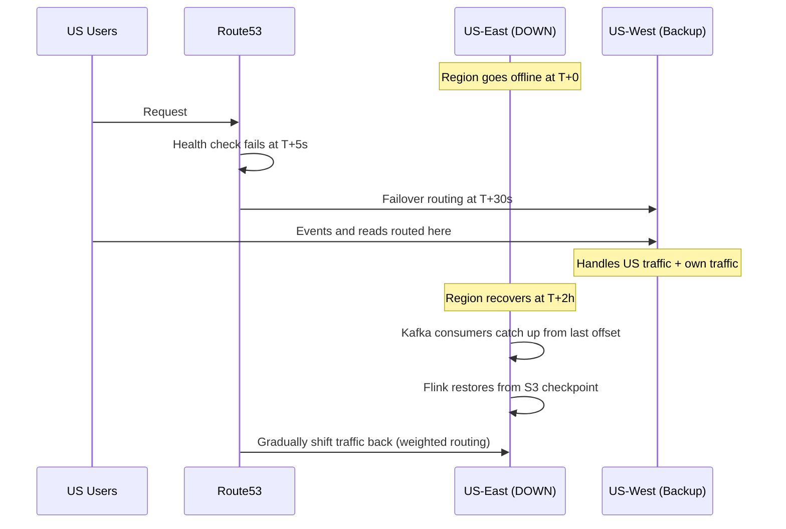
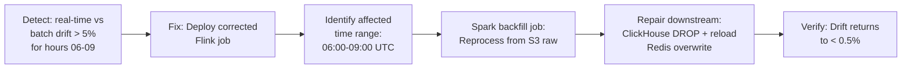
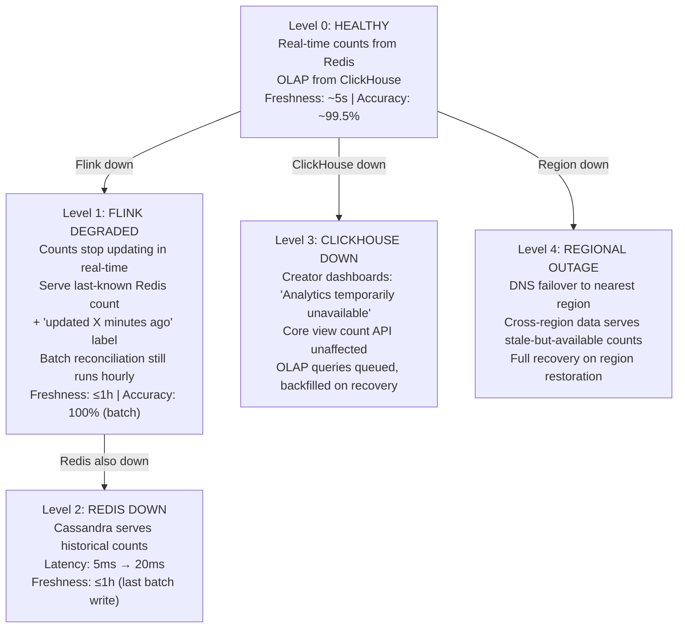

# Fault Tolerance

## 1. Failure Modes Map

| Component | Blast Radius | Recovery Time | Data Loss Risk | Auto-Recovery? |
|-----------|-------------|---------------|----------------|----------------|
| Single Edge PoP | Low (1 geo area) | Instant (DNS) | None | Yes |
| Kafka broker | Low (1 of 12) | ~30s (ISR takeover) | None | Yes |
| Kafka cluster (regional) | CRITICAL | ~5-10min | None (if S3 ok) | Partial |
| Flink job crash | Medium | ~60s (checkpoint) | <=60s of counts | Yes |
| Flink cluster down | High | ~5min | Minutes of counts | Yes (K8s) |
| Redis node | Low (1 of 6) | ~10s (sentinel failover) | None (rebuilt from Kafka) | Yes |
| Redis cluster down | High | ~2min | Counts stale | Partial |
| Cassandra node | Low (quorum intact) | Instant | None | Yes |
| S3 regional | CRITICAL (theoretical) | N/A (99.999999999%) | Theoretical | N/A |
| ClickHouse node | Low (replica takes over) | ~30s | None | Yes |
| ClickHouse cluster | High | ~5min | Queries unavailable | Partial |
| Batch job failure | Medium | Next hour retry | 1 hour delay | Yes (Airflow retry) |
| Schema Registry down | Medium | Cache covers ~hours | None | Yes (cache) |

---

## 2. Component-Level Resilience

### Kafka — The Backbone Cannot Fail



**Durability guarantees:**
```
Replication factor: 3 (across availability zones)
Producer acks: all (waits for all ISR replicas)
min.insync.replicas: 2
unclean.leader.election: false (never elect out-of-sync replica)
```

**Failure scenario: 1 broker dies**
- ISR shrinks to 2, production continues uninterrupted
- New broker joins, catches up from leader
- Zero data loss, zero downtime

**Failure scenario: Entire AZ down (2 of 3 brokers)**
- `min.insync.replicas` violated → producers block (cannot guarantee durability)
- Edge layer activates local buffer (in-memory ring buffer, 5-minute capacity ~35M events)
- Events replayed from edge buffer once Kafka recovers
- Impact: higher latency during outage, no data loss after recovery

### Flink — Crash Recovery via Checkpointing



**Recovery timeline:**
1. JobManager detects TaskManager failure via heartbeat (~5s)
2. Allocate new TaskManager container on K8s (~10s)
3. Restore from latest S3 checkpoint (~5s for incremental checkpoint)
4. Kafka consumer rewinds to checkpointed offsets
5. Reprocess events from checkpoint to now (~60s of data, takes ~10s)
6. **Total recovery: ~30s**

**Worst case:** 60s of approximate double-counting (events processed before crash + replayed after). Fixed by next hourly batch reconciliation. Redis `INCRBY` is not idempotent, but the batch `SET` corrects the drift.

### Redis — View Count Serving Must Stay Up



**Primary dies:**
1. Sentinel detects failure (~10s)
2. Replica promoted to primary (~2s)
3. Clients redirected via cluster slots update
4. Impact: ~10s of elevated latency, counts stale by at most 10s

**Entire cluster down (rare):**
1. Serving API falls back to Cassandra (latency: 5ms → 20ms, still within SLA)
2. Flink buffers count deltas in `view-counts-changelog` Kafka topic
3. On Redis recovery: replay changelog to rebuild state (~5 minutes for full rebuild)
4. Batch reconciliation corrects any gaps within the hour

**Why NOT Redis persistence (AOF/RDB)?**
Redis is a cache, not the source of truth. S3 + Kafka hold truth. Rebuilding from the Kafka changelog topic is faster and more reliable than replaying AOF. This simplifies operations significantly — no disk I/O tuning, no AOF rewrite storms.

### S3 — Source of Truth Protection

```
S3 durability: 99.999999999% (11 nines)

Additional safeguards:
  Cross-region replication: us-east-1 → eu-west-1 (async, ~15min lag)
  Versioning: enabled (accidental overwrites recoverable)
  Object Lock: compliance mode on raw event partitions
    → Even root account cannot delete within 30-day retention window
  
  Lifecycle policy:
    Hot  (S3 Standard):       0-30 days    ~$23/TB/month
    Warm (S3 Infrequent Access): 30-90 days  ~$12.5/TB/month
    Cold (S3 Glacier IR):     90-365 days   ~$4/TB/month
    Delete:                   > 365 days
```

---

## 3. Regional Failure & Disaster Recovery

### Scenario: US-East Region Goes Completely Offline



**Timeline:**
```
T+0s:    US-East edge PoPs stop responding
T+5s:    Route53 health checks fail
T+30s:   DNS failover routes US traffic to US-West
T+30s:   Edge PoPs in US-West accept US events (already running)

Impact on ingestion:
  T+0 to T+30s: Events buffered in client SDK (mobile) or lost (web)
  ~0.001% of daily events affected
  From T+30s: Normal operation via US-West

Impact on serving:
  US-West Redis has its own shard of counts
  Counts for US-East-popular videos may be stale by ~60s
  Batch reconciliation heals any gaps within 1 hour

Impact on batch pipeline:
  Spark jobs run in all regions independently
  US-East S3 data still accessible (S3 is multi-AZ, survives AZ failures)
  If truly inaccessible: cross-region S3 replica in EU-West has data
    with at most 15 minutes lag

Recovery:
  US-East comes back → edge PoPs resume
  Kafka consumers catch up from last committed offset
  Flink restores from S3 checkpoint
  DNS gradually shifts traffic back (weighted routing over 30 min)
  NO manual intervention required
```

---

## 4. Data Corruption & Reprocessing

### Scenario: Bug in Flink Dedup Logic Double-Counted Views for 3 Hours



**Recovery playbook:**
```
1. Fix the Flink job, deploy new version (canary → full rollout)
2. Identify affected time range: 06:00 - 09:00 UTC, April 6

3. Trigger backfill Spark job:
   spark-submit --class ViewBackfill \
     --input s3://yt-views-lake/raw/2026/04/06/hour={06,07,08,09}/ \
     --output s3://yt-views-lake/deduplicated/reprocessed/2026-04-06/

4. Spark recomputes exact counts from raw events (immutable in S3)

5. ClickHouse repair:
   ALTER TABLE fact_view_counts DROP PARTITION '202604'
     WHERE event_date = '2026-04-06' AND hour IN (6, 7, 8, 9);
   -- Reload from Spark output

6. Redis repair:
   For each affected video_id: SET vc:{video_id} <exact_count_from_batch>

7. Total recovery time: ~45 minutes for 3 hours of data
```

**This is why S3 raw events are the source of truth**, not Kafka or Redis. The ability to reprocess from immutable raw events is the ultimate safety net. The raw event log is append-only, version-controlled, and protected by Object Lock.

---

## 5. Graceful Degradation Hierarchy

When things go wrong, degrade gracefully — never show "service unavailable" for the view count.



**Key principle:** The video page view count is the highest-priority read. It degrades last. Creator dashboards and OLAP are lower priority and can show "temporarily unavailable" without user-facing impact.

**Degradation signals:**
```
Level 0 → Level 1: flink.consumer_lag > 2M events for > 5 min
Level 1 → Level 2: redis.cluster_health = DOWN
Level 0 → Level 3: clickhouse.query_error_rate > 50%
Level 0 → Level 4: region.health_check = FAIL for > 30s
```

Each transition is automatic (no human in the loop). Recovery transitions are also automatic but with a 5-minute stability check before promoting back to a healthier level.
