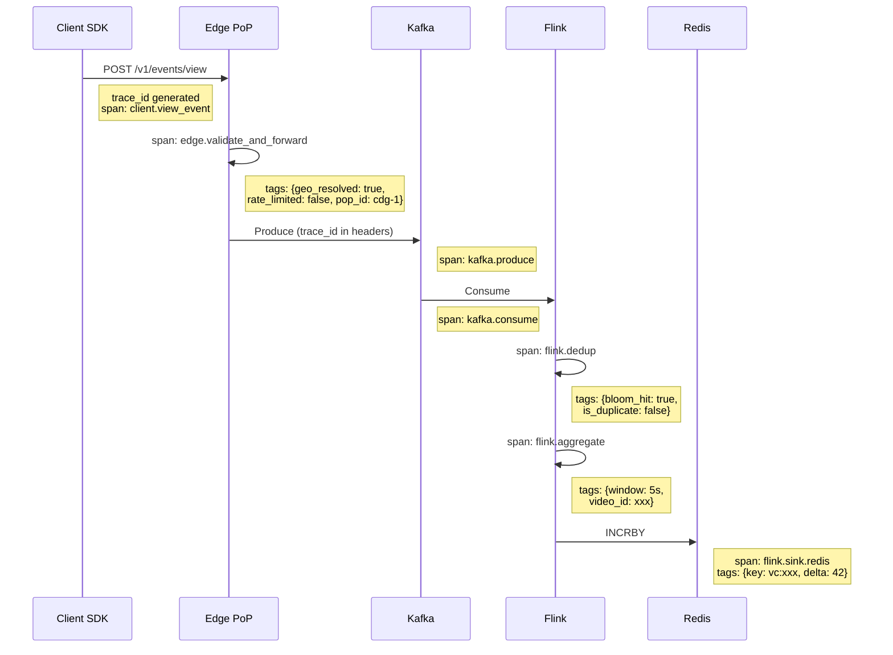
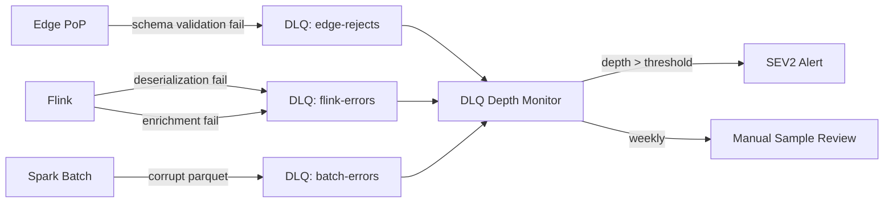

# Observability

## 1. Metrics Taxonomy

Organized using the **USE method** (Utilization, Saturation, Errors) plus business and data quality metrics.

### Ingestion Health

| Metric | Type | Alert Threshold | Why It Matters |
|--------|------|-----------------|----------------|
| `ingestion.events_per_sec` | Gauge | < 80K (too low) or > 600K (overload) | Detects ingestion failures or traffic spikes |
| `ingestion.reject_rate` | Ratio | > 15% | Schema changes broke clients, or bot attack |
| `ingestion.edge_to_kafka_latency_p99` | Histogram | > 500ms | Edge PoP to Kafka pipeline degraded |
| `ingestion.event_size_bytes_p99` | Histogram | > 2KB | Clients sending bloated payloads |
| `ingestion.geo_resolution_failures` | Counter | > 1% of events | MaxMind DB stale or corrupted |
| `ingestion.rate_limit_triggers_per_sec` | Counter | > 5K/sec | Bot attack or misconfigured client |

### Flink Pipeline Health

| Metric | Type | Alert Threshold | Why It Matters |
|--------|------|-----------------|----------------|
| `flink.checkpoint_duration_ms` | Histogram | > 30s | State too large or S3 slow |
| `flink.checkpoint_failures` | Counter | > 2 consecutive | Data loss risk — exactly-once broken |
| `flink.consumer_lag` | Gauge | > 500K events | Pipeline falling behind, counts going stale |
| `flink.dedup_bloom_false_positive_rate` | Gauge | > 3% | Bloom filter needs resizing |
| `flink.backpressure_ratio` | Gauge | > 0.5 for > 5min | Downstream sink slower than source |
| `flink.state_size_bytes` | Gauge | > 80% of RocksDB limit | Approaching OOM, need state TTL tuning |
| `flink.late_events_per_sec` | Counter | > 1% of throughput | Clock skew or mobile app buffering spike |
| `flink.restart_count` | Counter | > 3 in 1 hour | Recurring failure, not recovering cleanly |

### Kafka Cluster Health

| Metric | Type | Alert Threshold | Why It Matters |
|--------|------|-----------------|----------------|
| `kafka.under_replicated_partitions` | Gauge | > 0 for > 5min | Durability at risk |
| `kafka.isr_shrink_rate` | Counter | > 0 | Broker falling behind |
| `kafka.request_queue_size` | Gauge | > 1000 | Broker overloaded |
| `kafka.log_size_bytes` | Gauge | > 80% disk | Approaching disk full |
| `kafka.produce_latency_p99` | Histogram | > 100ms | Slow broker or network |

### Serving Layer Health

| Metric | Type | Alert Threshold | Why It Matters |
|--------|------|-----------------|----------------|
| `serving.read_latency_p99` | Histogram | > 100ms | SLA breach |
| `serving.redis_hit_rate` | Gauge | < 95% | Cache warming issue or key eviction |
| `serving.redis_to_cassandra_fallback_rate` | Gauge | > 5% | Redis capacity or eviction problem |
| `serving.stale_count_age_seconds` | Gauge | > 60s | Flink to Redis pipeline stalled |
| `serving.error_rate` | Ratio | > 0.1% | Service degradation |

### Business & Data Quality Metrics

| Metric | Type | Alert Threshold | Why It Matters |
|--------|------|-----------------|----------------|
| `data.realtime_vs_batch_drift_pct` | Gauge | > 2% | Real-time counts diverging from truth |
| `data.dedup_rate` | Gauge | < 3% or > 20% | Too low = dedup broken. Too high = bug or attack |
| `data.bot_flag_rate` | Gauge | > 10% | Bot attack underway |
| `data.views_per_video_p99` | Histogram | Sudden 10x spike | Viral event OR fraud |
| `data.null_field_rates` | Per-field gauge | > 1% for required fields | Schema regression in client SDK |
| `data.event_time_server_time_skew` | Histogram | > 5s at p99 | Client clock drift or NTP issue |
| `data.orphan_video_id_rate` | Gauge | > 0.1% | Video metadata sync broken |

---

## 2. Distributed Tracing

### Trace Propagation



### Sampling Strategy

At 115K events/sec, tracing everything is impossible (~100GB/day of trace data). Sampling strategy:

| Category | Sample Rate | Rationale |
|----------|------------|-----------|
| Uniform baseline | 1% | Baseline visibility across all paths |
| Bot-flagged events | 100% | Need full visibility for fraud investigation |
| Error events | 100% | Every error needs a traceable path |
| Slow events (>P99 latency) | 100% | Tail latency debugging |
| Specific video_id (debug) | 100% | On-demand for investigating specific videos |

**Head-based sampling**: Decision made at edge PoP, propagated downstream via W3C `traceparent` header. Ensures consistent traces (all spans for a sampled event are recorded, not just fragments).

---

## 3. Data Quality Monitoring

### Automated Checks (Great Expectations / dbt tests)

Run hourly on each S3 partition as it lands:

```
CHECK: row_count
  EXPECT: Within 20% of same hour last week (seasonality-adjusted)
  ACTION: PagerDuty alert to data oncall
  WHY: Detects silent data loss (Kafka sink stopped, S3 write failures)

CHECK: null_rates per column
  EXPECT: video_id NULL = 0%, country_code NULL < 0.1%, user_id NULL < 30%
  ACTION: Alert + auto-quarantine partition if critical field NULL > threshold
  WHY: Schema regressions in client SDK or edge layer bugs

CHECK: referential_integrity
  EXPECT: 99.9% of video_ids exist in dim_video table
  ACTION: Alert if orphan rate > 0.1%
  WHY: Video metadata ingestion pipeline broken or delayed

CHECK: distribution_stability
  EXPECT: country_code distribution within 3 sigma of 7-day rolling average
  ACTION: Alert on anomaly
  WHY: Geo-routing misconfiguration or regional outage not caught by infra monitoring

CHECK: freshness
  EXPECT: S3 partition for hour H available by H+20min
  ACTION: SEV2 alert if missing by H+30min
  WHY: Kafka Connect S3 sink stalled

CHECK: dedup_consistency
  EXPECT: Batch dedup removes 5-15% of raw events
  ACTION: Alert if outside range
  WHY: Too low = dedup not working. Too high = client SDK bug (double-firing)

CHECK: schema_evolution
  EXPECT: All events match registered Avro schema version
  ACTION: Alert on schema mismatch > 0.01%
  WHY: Unregistered schema deployed, backward compatibility broken
```

### Data Quality Dashboard Queries (ClickHouse)

```sql
-- Hourly drift between real-time and batch counts
SELECT
    event_date,
    hour,
    sum(realtime_count) AS rt_total,
    sum(batch_count) AS batch_total,
    abs(sum(realtime_count) - sum(batch_count)) * 100.0 
        / greatest(sum(batch_count), 1) AS drift_pct
FROM view_count_reconciliation
WHERE event_date >= today() - 7
GROUP BY event_date, hour
ORDER BY drift_pct DESC
LIMIT 20;
```

---

## 4. Dashboard Tiers

```
┌─────────────────────────────────────────────────────────────────────┐
│  TIER 1: OPERATIONAL (Grafana)                                       │
│  Audience: Data oncall engineer, SRE                                 │
│  Refresh: Every 10 seconds                                           │
│                                                                      │
│  Panels:                                                             │
│  • Real-time ingestion rate (events/sec by region)                   │
│  • Flink consumer lag (events behind, by topic)                      │
│  • Pipeline latency breakdown (edge → Kafka → Flink → Redis)        │
│  • Error rates by component                                         │
│  • Redis hit rate and memory usage                                   │
│  • Kafka partition lag heatmap (spot hot partitions)                 │
├─────────────────────────────────────────────────────────────────────┤
│  TIER 2: DATA QUALITY (dbt Cloud + Looker)                           │
│  Audience: Data team lead, analytics engineer                        │
│  Refresh: Hourly                                                     │
│                                                                      │
│  Panels:                                                             │
│  • Hourly drift: real-time vs batch counts (time series)             │
│  • Null rates per field (trend over 7 days)                          │
│  • Distribution anomalies (country, device, referral shifts)         │
│  • Freshness SLA compliance (% of partitions on time)                │
│  • Bot detection rate by region (trend, 7-day)                       │
│  • Schema version distribution (detect rollout issues)               │
├─────────────────────────────────────────────────────────────────────┤
│  TIER 3: BUSINESS (Looker / Tableau)                                 │
│  Audience: Product managers, creator ops, finance                    │
│  Refresh: Daily                                                      │
│                                                                      │
│  Panels:                                                             │
│  • Top videos by velocity (trending candidates)                      │
│  • Creator view count accuracy (real-time vs reconciled delta)       │
│  • Regional growth metrics (views by country, week-over-week)        │
│  • Ad monetization: qualified vs total views ratio                   │
│  • Bot exclusion impact on revenue ($ value of excluded views)       │
└─────────────────────────────────────────────────────────────────────┘
```

---

## 5. Alerting Philosophy

### Severity Levels

```
SEV1 — Page immediately (24/7):
  • Flink pipeline down or consumer lag > 2M events
  • Zero events ingested for > 2 minutes (any region)
  • Redis cluster unreachable
  • Batch reconciliation failed 2 consecutive hours
  • Kafka under-replicated partitions > 0 for > 10 minutes
  Escalation: Data oncall → team lead (15 min) → director (1 hour)

SEV2 — Page during business hours:
  • Real-time vs batch drift > 2%
  • Bot flag rate > 10% (sustained for 30 min)
  • Data quality check failures (null rates, distribution anomalies)
  • Cassandra read latency P99 > 500ms
  • S3 partition freshness SLA miss
  Escalation: Data oncall → team lead (next standup)

SEV3 — Ticket, next business day:
  • Bloom filter false positive rate creeping above 2%
  • Redis cache hit rate dropped below 95%
  • Late event rate above 1%
  • Single region ingestion rate anomaly (but global total normal)
  • ClickHouse query latency P99 above 2s
```

### Alert Hygiene Principles

```
1. Every alert must be actionable
   Bad:  "Kafka lag increased" (by how much? Is it recovering?)
   Good: "Kafka consumer lag > 500K for 5+ min, no recovery trend"

2. Alert on symptoms, not causes
   Bad:  "CPU usage high on Flink node"
   Good: "View count freshness > 60s" (which MIGHT be caused by CPU)

3. Runbook link required
   Every alert links to a runbook with:
   - What this alert means
   - How to diagnose
   - Common fixes
   - Escalation path

4. Alert fatigue budget
   Target: < 5 SEV1 pages per month
   Review: Weekly alert review to tune thresholds and remove noisy alerts
```

---

## 6. Dead-Letter Queue Monitoring

Events that fail processing at any stage land in a DLQ Kafka topic.



**DLQ monitoring:**
- `dlq.depth` per topic: SEV2 alert if growing faster than draining
- `dlq.event_sample`: Weekly automated review of 100 random DLQ events to categorize failure modes
- `dlq.replay`: Events can be replayed after fixing the issue (Kafka retention = 7 days on DLQ topics)
