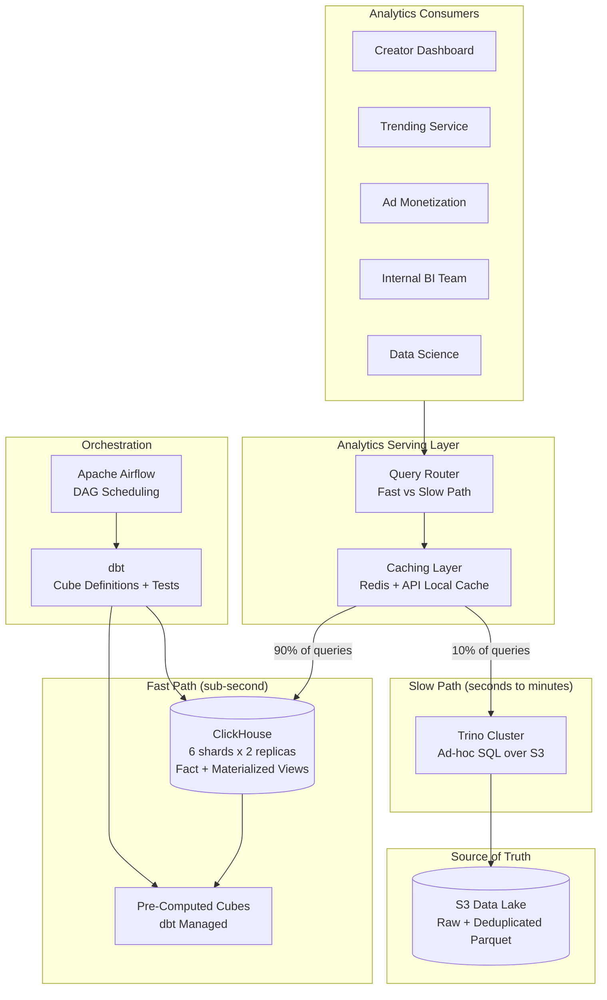
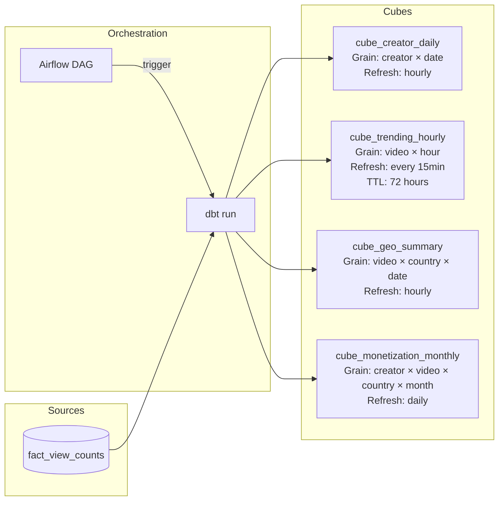
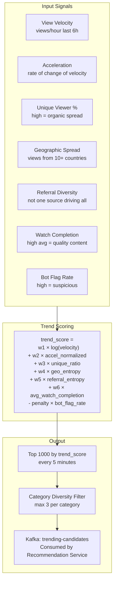
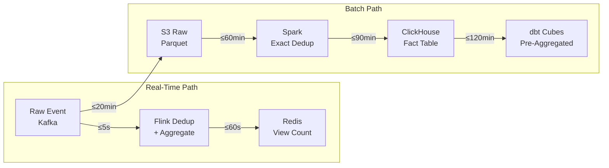
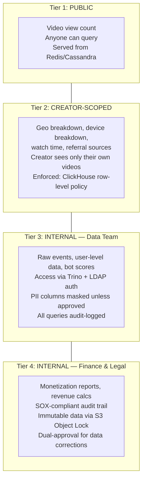

# OLAP & Extended Analytics System

## 1. Analytics Architecture Overview



---

## 2. Query Patterns & Access Paths

### Fast Path (ClickHouse, <1s) — 90% of Queries

#### Pattern 1: Creator Dashboard — "How are my videos doing this week?"

```sql
SELECT
    video_id,
    sum(view_count) AS views,
    sum(qualified_view_count) AS monetizable_views,
    sum(total_watch_time_ms) / greatest(sum(view_count), 1) AS avg_watch_time_ms
FROM mv_daily_video_views
WHERE creator_id = 'creator_xyz'
  AND event_date >= today() - 7
GROUP BY video_id
ORDER BY views DESC
LIMIT 20;

-- Hits: mv_daily_video_views materialized view
-- ORDER BY starts with creator_id → index seek, not scan
-- Latency: ~50ms
```

#### Pattern 2: Trending Service — "What's gaining velocity right now?"

```sql
SELECT
    curr.video_id,
    curr.views_last_hour,
    curr.views_last_hour / greatest(prev.views_prev_hour, 1) AS velocity_ratio
FROM (
    SELECT video_id, sum(view_count) AS views_last_hour
    FROM fact_view_counts
    WHERE event_date = today()
      AND hour = toHour(now()) - 1
    GROUP BY video_id
    HAVING views_last_hour > 10000
) curr
LEFT JOIN (
    SELECT video_id, sum(view_count) AS views_prev_hour
    FROM fact_view_counts
    WHERE event_date = today()
      AND hour = toHour(now()) - 2
    GROUP BY video_id
) prev ON curr.video_id = prev.video_id
ORDER BY velocity_ratio DESC
LIMIT 100;

-- Scans 2 hours of fact table, pre-filtered by view threshold
-- Latency: ~200ms
```

#### Pattern 3: Geo Breakdown — "Where are my viewers?"

```sql
SELECT
    country_code,
    sum(view_count) AS views,
    uniqMerge(unique_viewer_count) AS unique_viewers,
    sum(total_watch_time_ms) / 3600000.0 AS watch_hours
FROM fact_view_counts
WHERE video_id = 'video_abc'
  AND event_date BETWEEN '2026-03-01' AND '2026-04-06'
GROUP BY country_code
ORDER BY views DESC;

-- video_id is first in ORDER BY → fast index seek
-- HyperLogLog merge for unique viewers (no exact distinct needed)
-- Latency: ~100ms
```

#### Pattern 4: Ad Monetization Validation — "Billable views by country"

```sql
SELECT
    video_id,
    country_code,
    sum(qualified_view_count) - sum(bot_flagged_count) AS billable_views,
    sum(total_watch_time_ms) AS billable_watch_time_ms
FROM mv_daily_video_views
WHERE creator_id = 'creator_xyz'
  AND event_date BETWEEN '2026-03-01' AND '2026-03-31'
GROUP BY video_id, country_code;

-- Pre-aggregated MV, creator_id indexed
-- Latency: ~150ms
```

### Slow Path (Trino over S3, Seconds to Minutes) — 10% of Queries

#### Pattern 5: Ad-Hoc Investigation — "Referral analysis during Super Bowl"

```sql
SELECT
    referral_source,
    referral_url,
    count(*) AS views,
    avg(watch_duration_ms) AS avg_watch_ms,
    count(DISTINCT user_id) AS unique_users
FROM s3.yt_views_lake.raw
WHERE event_date = '2026-02-08'
  AND category_id = 'sports'
  AND country_code = 'US'
  AND hour BETWEEN 18 AND 23
GROUP BY referral_source, referral_url
ORDER BY views DESC
LIMIT 50;

-- Scans: ~300GB of raw Parquet (date+country partition pruning)
-- Latency: ~15-30 seconds
-- Why Trino: referral_url not in ClickHouse fact table (too high cardinality)
```

#### Pattern 6: Cohort Analysis — "Viewer retention for video X"

```sql
SELECT
    d.day_offset,
    count(DISTINCT d.user_id) AS returning_viewers,
    count(DISTINCT d.user_id) * 100.0 / d0.total AS retention_pct
FROM (
    SELECT user_id,
           datediff('day', DATE '2026-04-01', event_date) AS day_offset
    FROM s3.yt_views_lake.deduplicated
    WHERE video_id = 'video_abc'
      AND event_date BETWEEN '2026-04-01' AND '2026-04-07'
) d
CROSS JOIN (
    SELECT count(DISTINCT user_id) AS total
    FROM s3.yt_views_lake.deduplicated
    WHERE video_id = 'video_abc'
      AND event_date = '2026-04-01'
) d0
GROUP BY d.day_offset, d0.total
ORDER BY d.day_offset;

-- Multi-day scan with distinct counts (heavy)
-- Latency: ~45 seconds
-- Why Trino: Needs user-level data not in ClickHouse aggregates
```

---

## 3. Pre-Computed Cubes (dbt Managed)



### cube_creator_daily

```
Grain:     (creator_id, event_date)
Refresh:   Hourly (incremental append)
Use case:  Creator dashboard landing page — instant load

Measures:
  total_views           — sum of all views across creator's videos
  qualified_views       — monetizable views only
  unique_viewers        — HLL merged across videos
  total_watch_hours     — sum(watch_time_ms) / 3600000
  top_video_id          — video with most views that day
  top_country           — country with most views that day
  video_count_with_views — distinct videos that received views
```

### cube_trending_hourly

```
Grain:     (video_id, hour_bucket)
Refresh:   Every 15 minutes
Retention: 72 hours (short-lived, high churn)
Use case:  Trending algorithm input feed

Measures:
  view_count            — total views in this hour
  velocity              — views/hour (same as view_count but semantically named)
  acceleration          — velocity - previous_hour_velocity
  unique_viewer_count   — HLL for this hour
  geo_country_count     — distinct countries (proxy for geographic spread)
  referral_source_count — distinct referral sources (diversity signal)
```

### cube_geo_summary

```
Grain:     (video_id, country_code, event_date)
Refresh:   Hourly
Use case:  Creator geo analytics, ad revenue geographic split

Measures:
  views                      — total views from this country
  unique_viewers              — HLL per country
  watch_hours                 — total watch time in hours
  device_type_distribution   — JSON: {"MOBILE": 65, "DESKTOP": 30, "TV": 5}
  avg_watch_percentage       — average of watch_percentage
  peak_hour                  — hour with most views from this country
```

### cube_monetization_monthly

```
Grain:     (creator_id, video_id, country_code, month)
Refresh:   Daily (full month recompute for accuracy)
Use case:  Creator payouts, finance reconciliation

Measures:
  total_views           — all views
  billable_views        — qualified_views - bot_flagged_views
  billable_watch_time   — watch time for billable views only
  estimated_revenue     — billable_views × country_cpm_rate (joined from rate card)
  bot_excluded_count    — views excluded due to bot detection
  appeal_reinstated     — views reinstated after creator appeal
```

---

## 4. Trending Detection Pipeline

Trending is not just "most views." It's a composite signal that captures organic virality.



### Scoring Formula Deep Dive

```
trend_score = 
    w1 × log(velocity)
  + w2 × acceleration_normalized
  + w3 × unique_viewer_ratio
  + w4 × geo_entropy
  + w5 × referral_entropy
  + w6 × avg_watch_completion
  - penalty × bot_flag_rate

Where:
  velocity             = views in last hour
  acceleration         = (velocity_hour_N - velocity_hour_N-1) / velocity_hour_N-1
  unique_viewer_ratio  = unique_viewers / total_views (high = less repeat viewing)
  geo_entropy          = Shannon entropy over country distribution
  referral_entropy     = Shannon entropy over referral source distribution
  avg_watch_completion = mean(watch_percentage) across all views
  bot_flag_rate        = bot_flagged_views / total_views

Default weights: w1=0.3, w2=0.2, w3=0.15, w4=0.15, w5=0.1, w6=0.1, penalty=0.5
```

**Why Shannon entropy for geo and referral?**

A video with 1M views from 50 countries is more genuinely trending than 1M views from 1 country (could be a coordinated campaign or single-market event). Entropy captures this naturally:
- 1M views, 100% from US → entropy ≈ 0 (not geographically trending)
- 1M views, evenly from 50 countries → entropy ≈ 5.6 (globally trending)
- Same logic applies to referral diversity

**Pipeline execution:**
```
Source:     cube_trending_hourly (ClickHouse)
Frequency:  Every 5 minutes (Airflow short-interval DAG)
Compute:    SQL query over last 6 hours of hourly data
Filter:     Minimum 10K views/hour to be considered
Diversity:  No more than 3 videos per category_id in top 100
Output:     Kafka topic "trending-candidates" (JSON: video_id, trend_score, signals)
Consumer:   Recommendation service merges with personalization signals
```

---

## 5. Data Lineage & Freshness SLAs



### Freshness SLA Table

| Data Product | Freshness Target | Path | Consumer |
|-------------|-----------------|------|----------|
| Video page view count | ≤ 10 seconds | Real-time (Kafka → Flink → Redis) | Video page UI |
| Trending signals | ≤ 15 minutes | Flink → cube_trending_hourly | Recommendation service |
| Creator dashboard (today) | ≤ 2 hours | Batch → cube_creator_daily | Creator Studio |
| Geo breakdown | ≤ 2 hours | Batch → cube_geo_summary | Creator Studio |
| Ad monetization report | ≤ 24 hours | Daily batch reconciliation | Ad platform |
| Finance/payout data | ≤ 48 hours | Monthly recompute + human review | Finance team |

### Lineage Tracking

```
Every ClickHouse table and dbt model carries metadata:

  _pipeline_id:       UUID tracing back to the Airflow DAG run
  _source_partition:  S3 path(s) that produced this data
  _processed_at:      Timestamp of processing
  _row_count:         Number of rows produced
  _schema_version:    Avro schema version of source events

This enables:
  - "Why does this number look wrong?" → trace back to source partition
  - "When was this data last refreshed?" → _processed_at
  - "What version of events produced this?" → _schema_version
```

---

## 6. Access Control & Multi-Tenancy



### ClickHouse Row-Level Security

```sql
-- Creator can only see their own videos
CREATE ROW POLICY creator_isolation ON fact_view_counts
    USING creator_id = currentUser()
    TO creator_role;

-- Internal analysts see everything
CREATE ROW POLICY analyst_full_access ON fact_view_counts
    USING 1 = 1
    TO analyst_role;
```

### Trino Access Controls (for S3 raw data)

```
Catalog: s3.yt_views_lake

Column masking:
  user_id:    Visible only to role "data_engineer" and "data_scientist"
  ip_address: Always masked (SHA-256 hash shown instead)
  session_id: Visible only to role "data_engineer"

Row filtering:
  Raw events older than 30 days: Only "data_engineer" role
  Events with bot_score < 0.5: Available to all internal roles
  Bot-flagged events (bot_score >= 0.5): Only "fraud_analyst" role

Audit:
  Every Trino query logged to audit table with:
    query_id, user, role, tables_accessed, columns_accessed,
    rows_scanned, timestamp, query_text
```

---

## 7. Analytics System Evolution Path

```
Phase 1 (Launch):
  ClickHouse + Redis for core counts and basic analytics
  Manual SQL queries for ad-hoc analysis
  Cost: ~$150K/mo

Phase 2 (Scale):
  Add Trino for ad-hoc over S3
  Add dbt cubes for pre-computed aggregates
  Add trending pipeline
  Cost: ~$221K/mo (current design)

Phase 3 (ML-Enhanced):
  Real-time feature store for recommendation signals
  Viewer embedding pipeline for personalized analytics
  Predictive view count forecasting for creators
  Cost: ~$280K/mo

Phase 4 (Self-Serve):
  Semantic layer (Cube.js or similar) for non-technical users
  Natural language query interface
  Automated anomaly detection on all metrics
  Cost: ~$320K/mo
```
