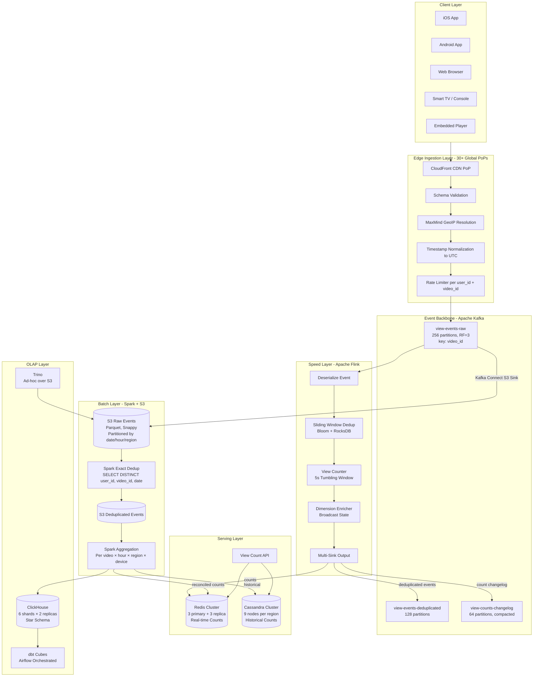
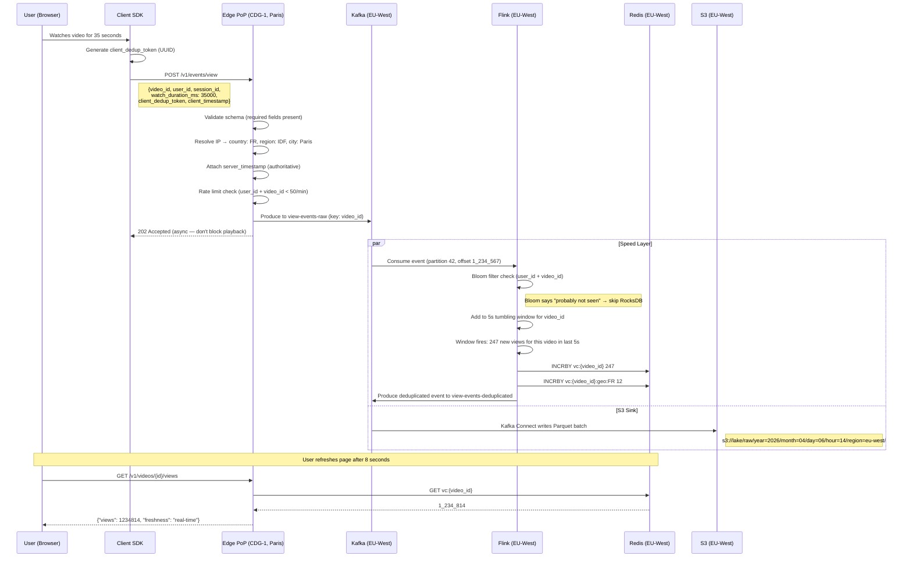
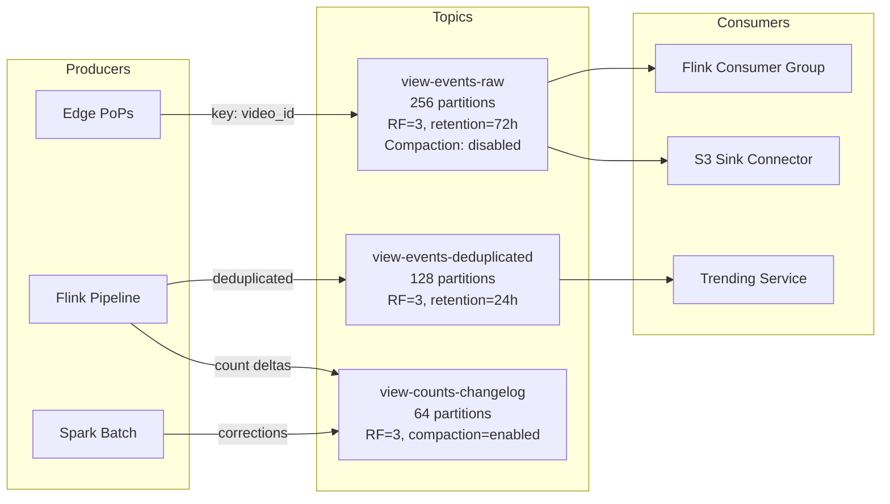
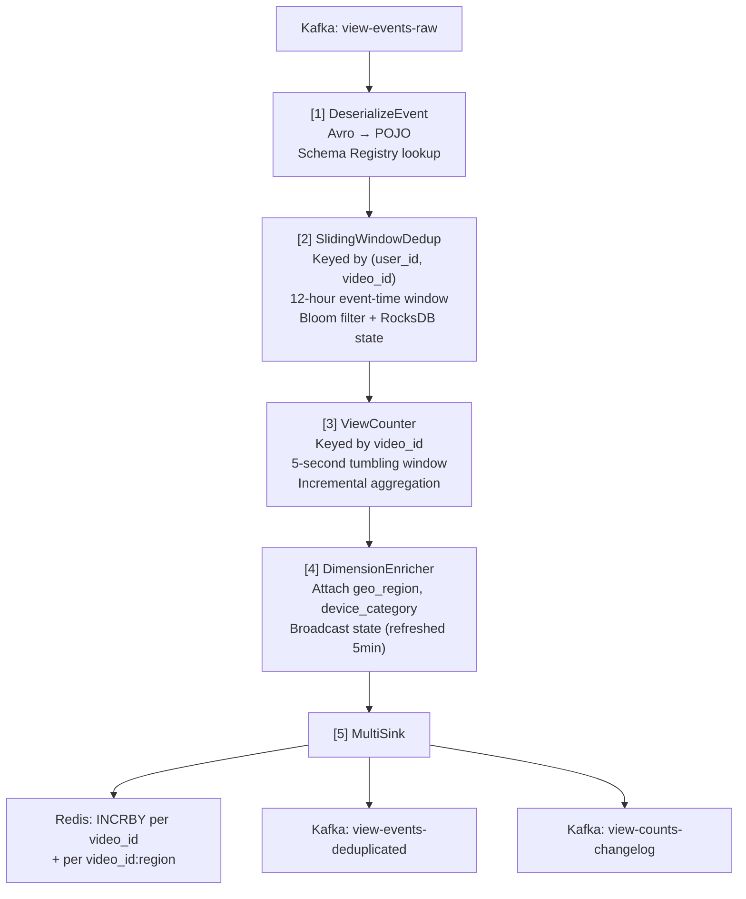
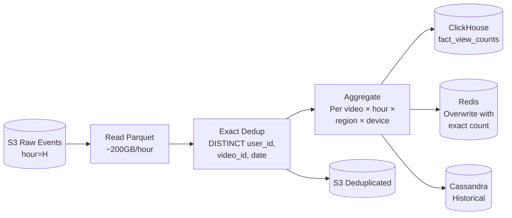
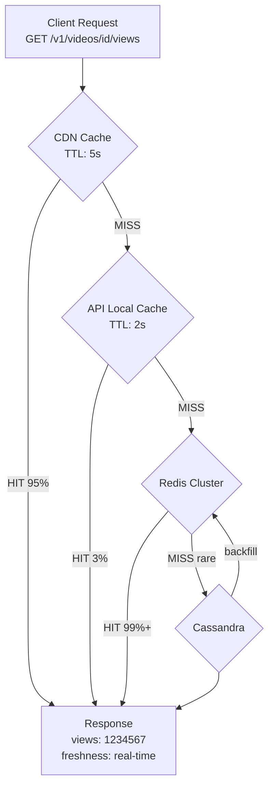

# System Architecture

## High-Level Architecture



---

## Happy Case: User Watches a Video



---

## Component Deep Dives

### 1. Edge Ingestion Layer

Deployed at 30+ CDN PoPs globally. Stateless, horizontally scaled.

**Responsibilities:**
- Schema validation — reject malformed events early (saves ~5-10% of downstream cost)
- Attach server-side timestamp — client clocks are unreliable; server timestamp is authoritative
- IP-to-geo resolution — MaxMind GeoIP at the edge (cheaper than doing it downstream for every event)
- Rate limiting — per `user_id` + `video_id` pair (first line of bot defense)
- Produce to nearest regional Kafka cluster

**Why at the edge?** At 10B events/day, every byte and millisecond saved at ingestion compounds. Rejecting 5-10% invalid events at the edge saves ~500GB/day of downstream processing. Geo resolution at the edge means the downstream pipeline doesn't need to carry raw IP addresses (PII benefit).

**Edge PoP configuration:**
```
rate_limiting:
  per_user_video: 50/minute    # No human watches 50 videos per minute
  per_ip: 1000/minute          # Shared IP (NAT) allowance
  burst: 10

validation:
  required_fields: [video_id, user_id, session_id, watch_duration_ms]
  max_event_size: 2KB
  max_watch_duration_ms: 86400000  # 24 hours (live streams)
```

---

### 2. Kafka Topology



**Partitioning by `video_id`** is critical: all events for a single video land on the same Flink task manager, enabling accurate per-video windowed dedup without distributed state coordination.

**Topic design rationale:**

| Topic | Partitions | Why |
|-------|-----------|-----|
| `view-events-raw` | 256 | High throughput (500K/sec peak). 256 = good parallelism for Flink. ~2K events/sec/partition. |
| `view-events-deduplicated` | 128 | Lower volume after dedup (~85-95% of raw). Consumed by trending + other downstream. |
| `view-counts-changelog` | 64 | Compacted topic. Low volume (count deltas per video, not individual events). |

**Hot partition mitigation (viral videos):**

A single viral video can generate 100K+ events/sec, overwhelming one partition. Solution: dynamic salted partitioning.

```
Normal mode:
  partition_key = video_id
  → All events on 1 partition (fine at normal volume)

Hot video detected (>10K events/min via Flink side-output):
  partition_key = video_id + ":" + (murmur3(user_id) % salt_factor)
  salt_factor = 4 (medium viral) or 16 (extreme viral)
  → Events spread across salt_factor partitions
  → Counts merged at serving layer: sum(vc:{video_id}:shard:*)

Detection: Flink maintains a Count-Min Sketch for top-K video velocity.
Edge layer picks up salt config via broadcast channel within ~30 seconds.
```

---

### 3. Flink Speed Layer

The core of the real-time path. Processes 115K events/sec avg with exactly-once semantics.



**Dedup strategy — Bloom filter + RocksDB hybrid:**

Why hybrid? Pure RocksDB state is accurate but expensive in I/O at 115K events/sec. Pure Bloom filter is fast but has false positives (missed dedup). The hybrid approach gets the best of both:

```
For each event (user_id, video_id):
  1. Hash into Bloom filter (in-memory, ~10 bits per element)
  2. If Bloom says "definitely not seen" → pass through (true negative)
  3. If Bloom says "maybe seen" → check RocksDB state (resolve ambiguity)
  4. If RocksDB confirms duplicate → discard
  5. If RocksDB says new → add to both Bloom and RocksDB, pass through

Performance impact:
  - ~85% of events: step 2 exits (Bloom true negative) → fast path
  - ~14% of events: step 2 triggers, step 4 confirms duplicate → medium path
  - ~1% of events: step 2 triggers (false positive), step 5 resolves → slow path
  - Net result: ~60% reduction in RocksDB I/O vs. pure state approach

Bloom filter sizing:
  - Expected elements per 12h window: ~2B (unique user+video pairs)
  - False positive rate target: 1%
  - Memory: ~2.4GB (10 bits × 2B elements / 1% FPR)
  - Distributed across Flink task managers by key
```

**Checkpointing:**
- Interval: every 60 seconds
- Backend: S3 (incremental checkpoints)
- On failure: restart from last checkpoint, replay Kafka from saved offsets
- Worst case: 60 seconds of re-processing
- Exactly-once guarantee: Kafka transactions + idempotent Redis writes (INCRBY is re-applied, corrected by batch)

---

### 4. Batch Layer (Spark + S3)

**S3 layout (Hive-style partitioning):**

```
s3://yt-views-lake/
  raw/
    year=2026/month=04/day=06/hour=14/
      region=us-east/
        part-00000.snappy.parquet
        part-00001.snappy.parquet
      region=eu-west/
        part-00000.snappy.parquet
  deduplicated/
    year=2026/month=04/day=06/
      part-00000.snappy.parquet
  aggregated/
    daily/year=2026/month=04/day=06/
    hourly/year=2026/month=04/day=06/hour=14/
```

**Hourly reconciliation job (the batch path):**



1. Read raw events from `s3://yt-views-lake/raw/.../hour=H`
2. Exact dedup: `SELECT DISTINCT user_id, video_id, date FROM events` (deterministic, no probabilistic structures)
3. Compute authoritative counts per `(video_id, date, hour, region, device)`
4. Write to ClickHouse `fact_view_counts` table
5. Publish correction deltas to `view-counts-changelog` Kafka topic
6. Redis counts updated: `SET video:{id}:views <exact_count>` (overwrites approximate)
7. Write to Cassandra for historical retention

**Why both real-time AND batch?** Real-time Flink gives ~99.5% accuracy (Bloom filter misses + race conditions). Batch gives 100% accuracy. The hourly reconciliation corrects the ~0.5% drift. Users see "close enough" in real-time; creators see exact numbers in dashboards.

---

### 5. Serving Layer



**Redis key schema:**
```
vc:{video_id}              → total view count (integer)
vc:{video_id}:rt           → real-time delta since last reconciliation
vc:{video_id}:geo:{region} → per-region count (for quick geo breakdowns)
vc:{video_id}:daily:{date} → daily breakdown (for sparklines)
```

**Why Cassandra for historical, not just Redis?**

1B videos x ~10 keys each = 10B keys. At ~100 bytes/key = ~1TB of Redis. Too expensive for cold data. Instead:
- Redis holds hot videos (last 30 days of active videos, ~100M videos) → ~100GB
- Cassandra holds everything (1B videos × years of history) → ~18TB, cheap on NVMe

**Read path latency budget:**
```
CDN hit:          ~5ms  (95% of requests for popular videos)
API cache hit:    ~10ms (3% — recently fetched by another user on same pod)
Redis hit:        ~15ms (1.9% — cache miss but video is active)
Cassandra hit:    ~25ms (0.1% — old video, not in Redis)
```
